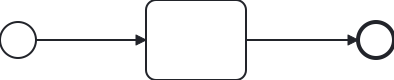
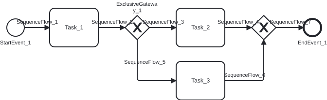
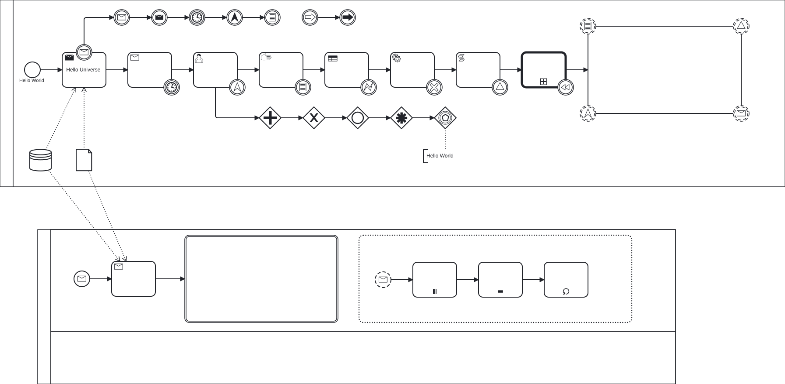
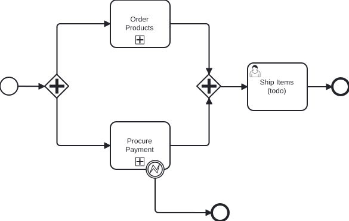
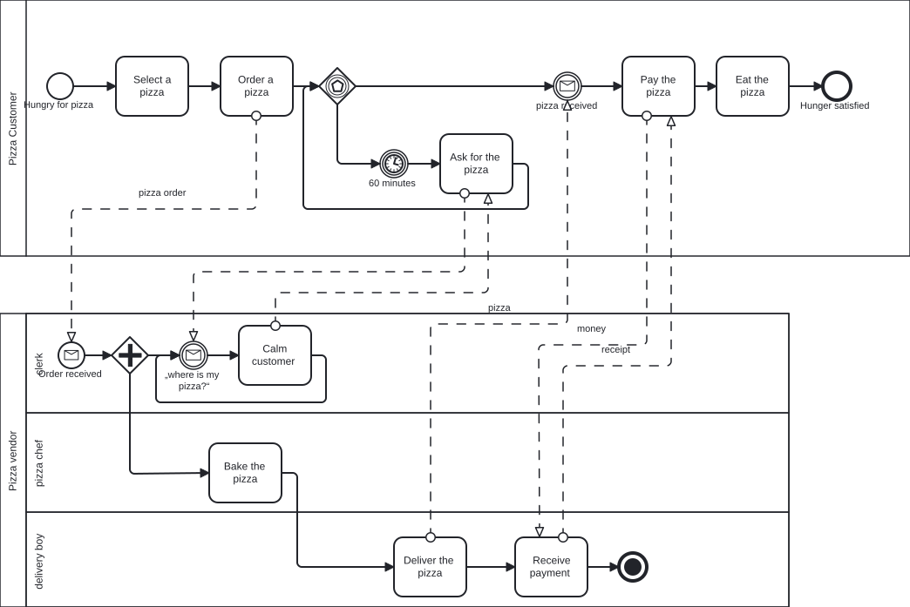
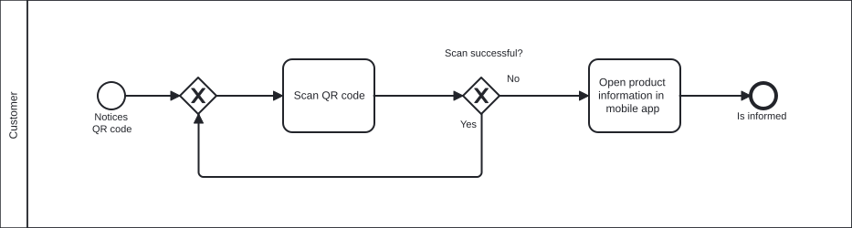

# Samples

## diagram.bpmn

### Source

```txt
<?xml version="1.0" encoding="UTF-8"?>
<bpmn:definitions xmlns:bpmn="http://www.omg.org/spec/BPMN/20100524/MODEL" xmlns:bpmndi="http://www.omg.org/spec/BPMN/20100524/DI" xmlns:di="http://www.omg.org/spec/DD/20100524/DI" xmlns:dc="http://www.omg.org/spec/DD/20100524/DC" xmlns:xsi="http://www.w3.org/2001/XMLSchema-instance" xmlns:vendor="http://vendor" id="Definitions_1" targetNamespace="http://bpmn.io/schema/bpmn">
  <bpmn:process id="Process_1" isExecutable="false">
    <bpmn:startEvent id="StartEvent_1">
      <bpmn:outgoing>SequenceFlow_1</bpmn:outgoing>
    </bpmn:startEvent>
    <bpmn:task id="Task_1">
      <bpmn:incoming>SequenceFlow_1</bpmn:incoming>
      <bpmn:outgoing>SequenceFlow_2</bpmn:outgoing>
    </bpmn:task>
    <bpmn:sequenceFlow id="SequenceFlow_1" sourceRef="StartEvent_1" targetRef="Task_1" vendor:allowDrop="bpmn:Task" />
    <bpmn:endEvent id="EndEvent_1">
      <bpmn:incoming>SequenceFlow_2</bpmn:incoming>
    </bpmn:endEvent>
    <bpmn:sequenceFlow id="SequenceFlow_2" sourceRef="Task_1" targetRef="EndEvent_1" />
  </bpmn:process>
  <bpmndi:BPMNDiagram id="BPMNDiagram_1">
    <bpmndi:BPMNPlane id="BPMNPlane_1" bpmnElement="Process_1">
      <bpmndi:BPMNShape id="_BPMNShape_StartEvent_2" bpmnElement="StartEvent_1">
        <dc:Bounds x="173" y="102" width="36" height="36" />
      </bpmndi:BPMNShape>
      <bpmndi:BPMNShape id="Task_1_di" bpmnElement="Task_1">
        <dc:Bounds x="319" y="80" width="100" height="80" />
      </bpmndi:BPMNShape>
      <bpmndi:BPMNEdge id="SequenceFlow_1_di" bpmnElement="SequenceFlow_1">
        <di:waypoint xsi:type="dc:Point" x="209" y="120" />
        <di:waypoint xsi:type="dc:Point" x="319" y="120" />
        <bpmndi:BPMNLabel>
          <dc:Bounds x="219" y="110" width="90" height="20" />
        </bpmndi:BPMNLabel>
      </bpmndi:BPMNEdge>
      <bpmndi:BPMNShape id="EndEvent_1_di" bpmnElement="EndEvent_1">
        <dc:Bounds x="531" y="102" width="36" height="36" />
        <bpmndi:BPMNLabel>
          <dc:Bounds x="504" y="138" width="90" height="20" />
        </bpmndi:BPMNLabel>
      </bpmndi:BPMNShape>
      <bpmndi:BPMNEdge id="SequenceFlow_2_di" bpmnElement="SequenceFlow_2">
        <di:waypoint xsi:type="dc:Point" x="419" y="120" />
        <di:waypoint xsi:type="dc:Point" x="531" y="120" />
        <bpmndi:BPMNLabel>
          <dc:Bounds x="430" y="110" width="90" height="20" />
        </bpmndi:BPMNLabel>
      </bpmndi:BPMNEdge>
    </bpmndi:BPMNPlane>
  </bpmndi:BPMNDiagram>
</bpmn:definitions>

```

### SVG



---

## editingElements.bpmn

### Source

```txt
<?xml version="1.0" encoding="UTF-8"?>
<bpmn2:definitions xmlns:xsi="http://www.w3.org/2001/XMLSchema-instance" xmlns:bpmn2="http://www.omg.org/spec/BPMN/20100524/MODEL" xmlns:bpmndi="http://www.omg.org/spec/BPMN/20100524/DI" xmlns:dc="http://www.omg.org/spec/DD/20100524/DC" xmlns:di="http://www.omg.org/spec/DD/20100524/DI" id="Definitions_1" targetNamespace="http://bpmn.io/schema/bpmn" exporter="Camunda Modeler" exporterVersion="4.1.0" xsi:schemaLocation="http://www.omg.org/spec/BPMN/20100524/MODEL BPMN20.xsd">
  <bpmn2:process id="Process_1" isExecutable="false">
    <bpmn2:startEvent id="StartEvent_1" name="StartEvent_1">
      <bpmn2:outgoing>SequenceFlow_1</bpmn2:outgoing>
    </bpmn2:startEvent>
    <bpmn2:task id="Task_1" name="Task_1">
      <bpmn2:incoming>SequenceFlow_1</bpmn2:incoming>
      <bpmn2:outgoing>SequenceFlow_2</bpmn2:outgoing>
    </bpmn2:task>
    <bpmn2:sequenceFlow id="SequenceFlow_1" name="SequenceFlow_1" sourceRef="StartEvent_1" targetRef="Task_1" />
    <bpmn2:exclusiveGateway id="ExclusiveGateway_1" name="ExclusiveGateway_1">
      <bpmn2:incoming>SequenceFlow_2</bpmn2:incoming>
      <bpmn2:outgoing>SequenceFlow_3</bpmn2:outgoing>
      <bpmn2:outgoing>SequenceFlow_5</bpmn2:outgoing>
    </bpmn2:exclusiveGateway>
    <bpmn2:sequenceFlow id="SequenceFlow_2" name="SequenceFlow_2" sourceRef="Task_1" targetRef="ExclusiveGateway_1" />
    <bpmn2:task id="Task_2" name="Task_2">
      <bpmn2:incoming>SequenceFlow_3</bpmn2:incoming>
      <bpmn2:outgoing>SequenceFlow_4</bpmn2:outgoing>
    </bpmn2:task>
    <bpmn2:sequenceFlow id="SequenceFlow_3" name="SequenceFlow_3" sourceRef="ExclusiveGateway_1" targetRef="Task_2" />
    <bpmn2:task id="Task_3" name="Task_3">
      <bpmn2:incoming>SequenceFlow_5</bpmn2:incoming>
      <bpmn2:outgoing>SequenceFlow_6</bpmn2:outgoing>
    </bpmn2:task>
    <bpmn2:sequenceFlow id="SequenceFlow_5" name="SequenceFlow_5" sourceRef="ExclusiveGateway_1" targetRef="Task_3" />
    <bpmn2:exclusiveGateway id="ExclusiveGateway_2">
      <bpmn2:incoming>SequenceFlow_4</bpmn2:incoming>
      <bpmn2:incoming>SequenceFlow_6</bpmn2:incoming>
      <bpmn2:outgoing>SequenceFlow_7</bpmn2:outgoing>
    </bpmn2:exclusiveGateway>
    <bpmn2:sequenceFlow id="SequenceFlow_4" name="SequenceFlow_4" sourceRef="Task_2" targetRef="ExclusiveGateway_2" />
    <bpmn2:sequenceFlow id="SequenceFlow_6" name="SequenceFlow_6" sourceRef="Task_3" targetRef="ExclusiveGateway_2" />
    <bpmn2:endEvent id="EndEvent_1" name="EndEvent_1">
      <bpmn2:incoming>SequenceFlow_7</bpmn2:incoming>
    </bpmn2:endEvent>
    <bpmn2:sequenceFlow id="SequenceFlow_7" name="SequenceFlow_7" sourceRef="ExclusiveGateway_2" targetRef="EndEvent_1" />
  </bpmn2:process>
  <bpmndi:BPMNDiagram id="BPMNDiagram_1">
    <bpmndi:BPMNPlane id="BPMNPlane_1" bpmnElement="Process_1">
      <bpmndi:BPMNEdge id="SequenceFlow_15sa8ce_di" bpmnElement="SequenceFlow_7">
        <di:waypoint x="735" y="100" />
        <di:waypoint x="792" y="100" />
        <bpmndi:BPMNLabel>
          <dc:Bounds x="746" y="82" width="36" height="14" />
        </bpmndi:BPMNLabel>
      </bpmndi:BPMNEdge>
      <bpmndi:BPMNEdge id="SequenceFlow_1smsur8_di" bpmnElement="SequenceFlow_6">
        <di:waypoint x="630" y="210" />
        <di:waypoint x="710" y="210" />
        <di:waypoint x="710" y="125" />
        <bpmndi:BPMNLabel>
          <dc:Bounds x="652" y="192" width="36" height="14" />
        </bpmndi:BPMNLabel>
      </bpmndi:BPMNEdge>
      <bpmndi:BPMNEdge id="SequenceFlow_1hte2hf_di" bpmnElement="SequenceFlow_4">
        <di:waypoint x="630" y="100" />
        <di:waypoint x="685" y="100" />
        <bpmndi:BPMNLabel>
          <dc:Bounds x="640" y="82" width="36" height="14" />
        </bpmndi:BPMNLabel>
      </bpmndi:BPMNEdge>
      <bpmndi:BPMNEdge id="SequenceFlow_0aq08pb_di" bpmnElement="SequenceFlow_5">
        <di:waypoint x="450" y="125" />
        <di:waypoint x="450" y="210" />
        <di:waypoint x="530" y="210" />
        <bpmndi:BPMNLabel>
          <dc:Bounds x="447" y="165" width="36" height="14" />
        </bpmndi:BPMNLabel>
      </bpmndi:BPMNEdge>
      <bpmndi:BPMNEdge id="SequenceFlow_02a2l5d_di" bpmnElement="SequenceFlow_3">
        <di:waypoint x="475" y="100" />
        <di:waypoint x="530" y="100" />
        <bpmndi:BPMNLabel>
          <dc:Bounds x="460" y="82" width="86" height="14" />
        </bpmndi:BPMNLabel>
      </bpmndi:BPMNEdge>
      <bpmndi:BPMNEdge id="SequenceFlow_1w4gozt_di" bpmnElement="SequenceFlow_2">
        <di:waypoint x="370" y="100" />
        <di:waypoint x="425" y="100" />
        <bpmndi:BPMNLabel>
          <dc:Bounds x="380" y="82" width="36" height="14" />
        </bpmndi:BPMNLabel>
      </bpmndi:BPMNEdge>
      <bpmndi:BPMNEdge id="SequenceFlow_1ryok29_di" bpmnElement="SequenceFlow_1">
        <di:waypoint x="218" y="100" />
        <di:waypoint x="270" y="100" />
        <bpmndi:BPMNLabel>
          <dc:Bounds x="226" y="82" width="36" height="14" />
        </bpmndi:BPMNLabel>
      </bpmndi:BPMNEdge>
      <bpmndi:BPMNShape id="_BPMNShape_StartEvent_2" bpmnElement="StartEvent_1">
        <dc:Bounds x="182" y="82" width="36" height="36" />
        <bpmndi:BPMNLabel>
          <dc:Bounds x="168" y="125" width="64" height="14" />
        </bpmndi:BPMNLabel>
      </bpmndi:BPMNShape>
      <bpmndi:BPMNShape id="Task_12zzrms_di" bpmnElement="Task_1">
        <dc:Bounds x="270" y="60" width="100" height="80" />
      </bpmndi:BPMNShape>
      <bpmndi:BPMNShape id="ExclusiveGateway_11f201q_di" bpmnElement="ExclusiveGateway_1" isMarkerVisible="true">
        <dc:Bounds x="425" y="75" width="50" height="50" />
        <bpmndi:BPMNLabel>
          <dc:Bounds x="422" y="45" width="56" height="14" />
        </bpmndi:BPMNLabel>
      </bpmndi:BPMNShape>
      <bpmndi:BPMNShape id="Task_0w550ac_di" bpmnElement="Task_2">
        <dc:Bounds x="530" y="60" width="100" height="80" />
      </bpmndi:BPMNShape>
      <bpmndi:BPMNShape id="Task_16o7rq6_di" bpmnElement="Task_3">
        <dc:Bounds x="530" y="170" width="100" height="80" />
      </bpmndi:BPMNShape>
      <bpmndi:BPMNShape id="ExclusiveGateway_1kr4wam_di" bpmnElement="ExclusiveGateway_2" isMarkerVisible="true">
        <dc:Bounds x="685" y="75" width="50" height="50" />
      </bpmndi:BPMNShape>
      <bpmndi:BPMNShape id="Event_0wya6az_di" bpmnElement="EndEvent_1">
        <dc:Bounds x="792" y="82" width="36" height="36" />
        <bpmndi:BPMNLabel>
          <dc:Bounds x="780" y="125" width="60" height="14" />
        </bpmndi:BPMNLabel>
      </bpmndi:BPMNShape>
    </bpmndi:BPMNPlane>
  </bpmndi:BPMNDiagram>
</bpmn2:definitions>

```

### SVG



---

## kitchen-sink.bpmn

### Source

```txt
<?xml version="1.0" encoding="UTF-8"?>
<bpmn:definitions xmlns:bpmn="http://www.omg.org/spec/BPMN/20100524/MODEL" xmlns:bpmndi="http://www.omg.org/spec/BPMN/20100524/DI" xmlns:di="http://www.omg.org/spec/DD/20100524/DI" xmlns:dc="http://www.omg.org/spec/DD/20100524/DC" xmlns:xsi="http://www.w3.org/2001/XMLSchema-instance" id="Definitions_0chb8xu" targetNamespace="http://bpmn.io/schema/bpmn" exporter="Camunda Modeler" exporterVersion="1.14.0">
  <bpmn:collaboration id="Collaboration_1g73j63">
    <bpmn:participant id="Participant_1vedrhc" processRef="Process_1" />
    <bpmn:participant id="Participant_1oxeadm" processRef="Process_0abj3w2" />
  </bpmn:collaboration>
  <bpmn:process id="Process_1" isExecutable="true">
    <bpmn:sequenceFlow id="SequenceFlow_1lzbqcf" sourceRef="ExclusiveGateway_08cpnyi" targetRef="ExclusiveGateway_0w2zn42" />
    <bpmn:sequenceFlow id="SequenceFlow_096651s" sourceRef="ExclusiveGateway_1ip75mm" targetRef="ExclusiveGateway_08cpnyi" />
    <bpmn:sequenceFlow id="SequenceFlow_1kzeawi" sourceRef="ExclusiveGateway_0205g5v" targetRef="ExclusiveGateway_1ip75mm" />
    <bpmn:sequenceFlow id="SequenceFlow_0o98gnu" sourceRef="ExclusiveGateway_0pueljs" targetRef="ExclusiveGateway_0205g5v" />
    <bpmn:sequenceFlow id="SequenceFlow_1w1mjsk" sourceRef="Task_1x2pxcn" targetRef="ExclusiveGateway_0pueljs" />
    <bpmn:sequenceFlow id="SequenceFlow_03fvpge" sourceRef="IntermediateThrowEvent_1liyvfn" targetRef="IntermediateThrowEvent_0iysg53" />
    <bpmn:sequenceFlow id="SequenceFlow_01nciaj" sourceRef="IntermediateThrowEvent_0d0om9q" targetRef="IntermediateThrowEvent_0731jft" />
    <bpmn:sequenceFlow id="SequenceFlow_1o24o7s" sourceRef="IntermediateThrowEvent_1vaa2b4" targetRef="IntermediateThrowEvent_0d0om9q" />
    <bpmn:sequenceFlow id="SequenceFlow_16qfe96" sourceRef="IntermediateThrowEvent_1755nsj" targetRef="IntermediateThrowEvent_1vaa2b4" />
    <bpmn:sequenceFlow id="SequenceFlow_0zijygl" sourceRef="IntermediateThrowEvent_17ci1dt" targetRef="IntermediateThrowEvent_1755nsj" />
    <bpmn:sequenceFlow id="SequenceFlow_16ikfuz" sourceRef="BoundaryEvent_0nu3946" targetRef="IntermediateThrowEvent_17ci1dt" />
    <bpmn:sequenceFlow id="SequenceFlow_0wkbfvq" sourceRef="Task_0vcqxha" targetRef="Task_19iw28f" />
    <bpmn:sequenceFlow id="SequenceFlow_1rbc2ob" sourceRef="Task_1ank6jx" targetRef="Task_0vcqxha" />
    <bpmn:sequenceFlow id="SequenceFlow_0zl93aa" sourceRef="Task_1suvpez" targetRef="Task_1ank6jx" />
    <bpmn:sequenceFlow id="SequenceFlow_0x17o4h" sourceRef="Task_1165fo8" targetRef="Task_1suvpez" />
    <bpmn:sequenceFlow id="SequenceFlow_1wpuoag" sourceRef="Task_12nft3n" targetRef="Task_1165fo8" />
    <bpmn:sequenceFlow id="SequenceFlow_1b4hmmz" sourceRef="Task_1x2pxcn" targetRef="Task_12nft3n" />
    <bpmn:sequenceFlow id="SequenceFlow_1u0842r" sourceRef="Task_0oz8m30" targetRef="Task_1x2pxcn" />
    <bpmn:sequenceFlow id="SequenceFlow_0ln9nja" sourceRef="Task_0qibn8y" targetRef="Task_0oz8m30" />
    <bpmn:sequenceFlow id="SequenceFlow_1epq0vo" sourceRef="StartEvent_1" targetRef="Task_0qibn8y" />
    <bpmn:boundaryEvent id="BoundaryEvent_1pheq3p" cancelActivity="false" attachedToRef="Task_19iw28f">
      <bpmn:signalEventDefinition />
    </bpmn:boundaryEvent>
    <bpmn:boundaryEvent id="BoundaryEvent_04znm02" cancelActivity="false" attachedToRef="Task_19iw28f">
      <bpmn:conditionalEventDefinition>
        <bpmn:condition xsi:type="bpmn:tFormalExpression" />
      </bpmn:conditionalEventDefinition>
    </bpmn:boundaryEvent>
    <bpmn:boundaryEvent id="BoundaryEvent_1c7kst9" cancelActivity="false" attachedToRef="Task_19iw28f">
      <bpmn:escalationEventDefinition />
    </bpmn:boundaryEvent>
    <bpmn:boundaryEvent id="BoundaryEvent_0iiyz0j" cancelActivity="false" attachedToRef="Task_19iw28f">
      <bpmn:messageEventDefinition />
    </bpmn:boundaryEvent>
    <bpmn:boundaryEvent id="BoundaryEvent_1ge1buo" attachedToRef="Task_0vcqxha">
      <bpmn:compensateEventDefinition />
    </bpmn:boundaryEvent>
    <bpmn:boundaryEvent id="BoundaryEvent_00et2aq" attachedToRef="Task_1suvpez">
      <bpmn:cancelEventDefinition />
    </bpmn:boundaryEvent>
    <bpmn:boundaryEvent id="BoundaryEvent_0dysuz9" attachedToRef="Task_1165fo8">
      <bpmn:errorEventDefinition />
    </bpmn:boundaryEvent>
    <bpmn:boundaryEvent id="BoundaryEvent_09zzeyl" attachedToRef="Task_12nft3n">
      <bpmn:conditionalEventDefinition>
        <bpmn:condition xsi:type="bpmn:tFormalExpression" />
      </bpmn:conditionalEventDefinition>
    </bpmn:boundaryEvent>
    <bpmn:boundaryEvent id="BoundaryEvent_14eor8w" attachedToRef="Task_1x2pxcn">
      <bpmn:escalationEventDefinition />
    </bpmn:boundaryEvent>
    <bpmn:boundaryEvent id="BoundaryEvent_1fs6xst" attachedToRef="Task_0oz8m30">
      <bpmn:timerEventDefinition />
    </bpmn:boundaryEvent>
    <bpmn:boundaryEvent id="BoundaryEvent_0nu3946" attachedToRef="Task_0qibn8y">
      <bpmn:outgoing>SequenceFlow_16ikfuz</bpmn:outgoing>
      <bpmn:messageEventDefinition />
    </bpmn:boundaryEvent>
    <bpmn:subProcess id="Task_19iw28f">
      <bpmn:incoming>SequenceFlow_0wkbfvq</bpmn:incoming>
    </bpmn:subProcess>
    <bpmn:eventBasedGateway id="ExclusiveGateway_0w2zn42">
      <bpmn:incoming>SequenceFlow_1lzbqcf</bpmn:incoming>
    </bpmn:eventBasedGateway>
    <bpmn:complexGateway id="ExclusiveGateway_08cpnyi">
      <bpmn:incoming>SequenceFlow_096651s</bpmn:incoming>
      <bpmn:outgoing>SequenceFlow_1lzbqcf</bpmn:outgoing>
    </bpmn:complexGateway>
    <bpmn:inclusiveGateway id="ExclusiveGateway_1ip75mm">
      <bpmn:incoming>SequenceFlow_1kzeawi</bpmn:incoming>
      <bpmn:outgoing>SequenceFlow_096651s</bpmn:outgoing>
    </bpmn:inclusiveGateway>
    <bpmn:exclusiveGateway id="ExclusiveGateway_0205g5v">
      <bpmn:incoming>SequenceFlow_0o98gnu</bpmn:incoming>
      <bpmn:outgoing>SequenceFlow_1kzeawi</bpmn:outgoing>
    </bpmn:exclusiveGateway>
    <bpmn:parallelGateway id="ExclusiveGateway_0pueljs">
      <bpmn:incoming>SequenceFlow_1w1mjsk</bpmn:incoming>
      <bpmn:outgoing>SequenceFlow_0o98gnu</bpmn:outgoing>
    </bpmn:parallelGateway>
    <bpmn:intermediateThrowEvent id="IntermediateThrowEvent_0iysg53">
      <bpmn:incoming>SequenceFlow_03fvpge</bpmn:incoming>
      <bpmn:linkEventDefinition />
    </bpmn:intermediateThrowEvent>
    <bpmn:intermediateCatchEvent id="IntermediateThrowEvent_1liyvfn">
      <bpmn:outgoing>SequenceFlow_03fvpge</bpmn:outgoing>
      <bpmn:linkEventDefinition />
    </bpmn:intermediateCatchEvent>
    <bpmn:intermediateCatchEvent id="IntermediateThrowEvent_0731jft">
      <bpmn:incoming>SequenceFlow_01nciaj</bpmn:incoming>
      <bpmn:conditionalEventDefinition>
        <bpmn:condition xsi:type="bpmn:tFormalExpression" />
      </bpmn:conditionalEventDefinition>
    </bpmn:intermediateCatchEvent>
    <bpmn:intermediateThrowEvent id="IntermediateThrowEvent_0d0om9q">
      <bpmn:incoming>SequenceFlow_1o24o7s</bpmn:incoming>
      <bpmn:outgoing>SequenceFlow_01nciaj</bpmn:outgoing>
      <bpmn:escalationEventDefinition />
    </bpmn:intermediateThrowEvent>
    <bpmn:intermediateCatchEvent id="IntermediateThrowEvent_1vaa2b4">
      <bpmn:incoming>SequenceFlow_16qfe96</bpmn:incoming>
      <bpmn:outgoing>SequenceFlow_1o24o7s</bpmn:outgoing>
      <bpmn:timerEventDefinition />
    </bpmn:intermediateCatchEvent>
    <bpmn:intermediateThrowEvent id="IntermediateThrowEvent_1755nsj">
      <bpmn:incoming>SequenceFlow_0zijygl</bpmn:incoming>
      <bpmn:outgoing>SequenceFlow_16qfe96</bpmn:outgoing>
      <bpmn:messageEventDefinition />
    </bpmn:intermediateThrowEvent>
    <bpmn:intermediateCatchEvent id="IntermediateThrowEvent_17ci1dt">
      <bpmn:incoming>SequenceFlow_16ikfuz</bpmn:incoming>
      <bpmn:outgoing>SequenceFlow_0zijygl</bpmn:outgoing>
      <bpmn:messageEventDefinition />
    </bpmn:intermediateCatchEvent>
    <bpmn:dataObjectReference id="DataObjectReference_1mn1rac" dataObjectRef="DataObject_0ru5fjy" />
    <bpmn:dataObject id="DataObject_0ru5fjy" />
    <bpmn:callActivity id="Task_0vcqxha">
      <bpmn:incoming>SequenceFlow_1rbc2ob</bpmn:incoming>
      <bpmn:outgoing>SequenceFlow_0wkbfvq</bpmn:outgoing>
    </bpmn:callActivity>
    <bpmn:serviceTask id="Task_1suvpez">
      <bpmn:incoming>SequenceFlow_0x17o4h</bpmn:incoming>
      <bpmn:outgoing>SequenceFlow_0zl93aa</bpmn:outgoing>
    </bpmn:serviceTask>
    <bpmn:businessRuleTask id="Task_1165fo8">
      <bpmn:incoming>SequenceFlow_1wpuoag</bpmn:incoming>
      <bpmn:outgoing>SequenceFlow_0x17o4h</bpmn:outgoing>
    </bpmn:businessRuleTask>
    <bpmn:manualTask id="Task_12nft3n">
      <bpmn:incoming>SequenceFlow_1b4hmmz</bpmn:incoming>
      <bpmn:outgoing>SequenceFlow_1wpuoag</bpmn:outgoing>
    </bpmn:manualTask>
    <bpmn:userTask id="Task_1x2pxcn">
      <bpmn:incoming>SequenceFlow_1u0842r</bpmn:incoming>
      <bpmn:outgoing>SequenceFlow_1b4hmmz</bpmn:outgoing>
      <bpmn:outgoing>SequenceFlow_1w1mjsk</bpmn:outgoing>
    </bpmn:userTask>
    <bpmn:receiveTask id="Task_0oz8m30">
      <bpmn:incoming>SequenceFlow_0ln9nja</bpmn:incoming>
      <bpmn:outgoing>SequenceFlow_1u0842r</bpmn:outgoing>
    </bpmn:receiveTask>
    <bpmn:sendTask id="Task_0qibn8y" name="Hello Universe">
      <bpmn:incoming>SequenceFlow_1epq0vo</bpmn:incoming>
      <bpmn:outgoing>SequenceFlow_0ln9nja</bpmn:outgoing>
      <bpmn:property id="Property_0zc339d" name="__targetRef_placeholder" />
      <bpmn:dataInputAssociation id="DataInputAssociation_09471iu">
        <bpmn:sourceRef>DataStoreReference_0rsnz87</bpmn:sourceRef>
        <bpmn:targetRef>Property_0zc339d</bpmn:targetRef>
      </bpmn:dataInputAssociation>
      <bpmn:dataInputAssociation id="DataInputAssociation_0nda90w">
        <bpmn:sourceRef>DataObjectReference_1mn1rac</bpmn:sourceRef>
        <bpmn:targetRef>Property_0zc339d</bpmn:targetRef>
      </bpmn:dataInputAssociation>
    </bpmn:sendTask>
    <bpmn:dataStoreReference id="DataStoreReference_0rsnz87" />
    <bpmn:startEvent id="StartEvent_1" name="Hello World">
      <bpmn:outgoing>SequenceFlow_1epq0vo</bpmn:outgoing>
    </bpmn:startEvent>
    <bpmn:scriptTask id="Task_1ank6jx">
      <bpmn:incoming>SequenceFlow_0zl93aa</bpmn:incoming>
      <bpmn:outgoing>SequenceFlow_1rbc2ob</bpmn:outgoing>
    </bpmn:scriptTask>
    <bpmn:boundaryEvent id="BoundaryEvent_0krxj1n" attachedToRef="Task_1ank6jx">
      <bpmn:signalEventDefinition />
    </bpmn:boundaryEvent>
    <bpmn:association id="Association_1whofyr" sourceRef="ExclusiveGateway_0w2zn42" targetRef="TextAnnotation_13stt0v" />
    <bpmn:textAnnotation id="TextAnnotation_13stt0v">
      <bpmn:text>Hello World</bpmn:text>
    </bpmn:textAnnotation>
  </bpmn:process>
  <bpmn:process id="Process_0abj3w2" isExecutable="false">
    <bpmn:laneSet>
      <bpmn:lane id="Lane_1ojyrnr">
        <bpmn:flowNodeRef>StartEvent_124mvrl</bpmn:flowNodeRef>
        <bpmn:flowNodeRef>Task_1sga8pc</bpmn:flowNodeRef>
        <bpmn:flowNodeRef>Task_0t0pnde</bpmn:flowNodeRef>
        <bpmn:flowNodeRef>Task_1mvn5bz</bpmn:flowNodeRef>
      </bpmn:lane>
      <bpmn:lane id="Lane_1vnc0eh" />
    </bpmn:laneSet>
    <bpmn:startEvent id="StartEvent_124mvrl">
      <bpmn:outgoing>SequenceFlow_19uy1a4</bpmn:outgoing>
      <bpmn:messageEventDefinition />
    </bpmn:startEvent>
    <bpmn:receiveTask id="Task_1sga8pc">
      <bpmn:incoming>SequenceFlow_19uy1a4</bpmn:incoming>
      <bpmn:outgoing>SequenceFlow_0q8fegg</bpmn:outgoing>
      <bpmn:property id="Property_0ryww93" name="__targetRef_placeholder" />
      <bpmn:dataInputAssociation id="DataInputAssociation_1yjqn95">
        <bpmn:sourceRef>DataStoreReference_0rsnz87</bpmn:sourceRef>
        <bpmn:targetRef>Property_0ryww93</bpmn:targetRef>
      </bpmn:dataInputAssociation>
      <bpmn:dataInputAssociation id="DataInputAssociation_0i7ovvu">
        <bpmn:sourceRef>DataObjectReference_1mn1rac</bpmn:sourceRef>
        <bpmn:targetRef>Property_0ryww93</bpmn:targetRef>
      </bpmn:dataInputAssociation>
    </bpmn:receiveTask>
    <bpmn:sequenceFlow id="SequenceFlow_19uy1a4" sourceRef="StartEvent_124mvrl" targetRef="Task_1sga8pc" />
    <bpmn:sequenceFlow id="SequenceFlow_0q8fegg" sourceRef="Task_1sga8pc" targetRef="Task_0t0pnde" />
    <bpmn:transaction id="Task_0t0pnde">
      <bpmn:incoming>SequenceFlow_0q8fegg</bpmn:incoming>
    </bpmn:transaction>
    <bpmn:subProcess id="Task_1mvn5bz" triggeredByEvent="true">
      <bpmn:startEvent id="StartEvent_1365x5u" isInterrupting="false">
        <bpmn:outgoing>SequenceFlow_1eqmz87</bpmn:outgoing>
        <bpmn:messageEventDefinition />
      </bpmn:startEvent>
      <bpmn:task id="Task_11mt25q">
        <bpmn:incoming>SequenceFlow_1eqmz87</bpmn:incoming>
        <bpmn:outgoing>SequenceFlow_0feztce</bpmn:outgoing>
        <bpmn:multiInstanceLoopCharacteristics />
      </bpmn:task>
      <bpmn:sequenceFlow id="SequenceFlow_1eqmz87" sourceRef="StartEvent_1365x5u" targetRef="Task_11mt25q" />
      <bpmn:task id="Task_194rzhn">
        <bpmn:incoming>SequenceFlow_0feztce</bpmn:incoming>
        <bpmn:outgoing>SequenceFlow_0e3fb2p</bpmn:outgoing>
        <bpmn:multiInstanceLoopCharacteristics isSequential="true" />
      </bpmn:task>
      <bpmn:sequenceFlow id="SequenceFlow_0feztce" sourceRef="Task_11mt25q" targetRef="Task_194rzhn" />
      <bpmn:task id="Task_1ug2w5g">
        <bpmn:incoming>SequenceFlow_0e3fb2p</bpmn:incoming>
        <bpmn:standardLoopCharacteristics />
      </bpmn:task>
      <bpmn:sequenceFlow id="SequenceFlow_0e3fb2p" sourceRef="Task_194rzhn" targetRef="Task_1ug2w5g" />
    </bpmn:subProcess>
  </bpmn:process>
  <bpmndi:BPMNDiagram id="BPMNDiagram_1">
    <bpmndi:BPMNPlane id="BPMNPlane_1" bpmnElement="Collaboration_1g73j63">
      <bpmndi:BPMNShape id="Participant_1vedrhc_di" bpmnElement="Participant_1vedrhc">
        <dc:Bounds x="123" y="-16" width="1793" height="428" />
      </bpmndi:BPMNShape>
      <bpmndi:BPMNShape id="_BPMNShape_StartEvent_2" bpmnElement="StartEvent_1">
        <dc:Bounds x="179" y="126" width="36" height="36" />
        <bpmndi:BPMNLabel>
          <dc:Bounds x="169" y="162" width="57" height="12" />
        </bpmndi:BPMNLabel>
      </bpmndi:BPMNShape>
      <bpmndi:BPMNEdge id="SequenceFlow_1epq0vo_di" bpmnElement="SequenceFlow_1epq0vo">
        <di:waypoint x="215" y="144" />
        <di:waypoint x="265" y="144" />
        <bpmndi:BPMNLabel>
          <dc:Bounds x="240" y="123" width="0" height="12" />
        </bpmndi:BPMNLabel>
      </bpmndi:BPMNEdge>
      <bpmndi:BPMNShape id="Participant_1oxeadm_di" bpmnElement="Participant_1oxeadm">
        <dc:Bounds x="209" y="510" width="1457" height="354" />
      </bpmndi:BPMNShape>
      <bpmndi:BPMNShape id="BoundaryEvent_0ylc83n_di" bpmnElement="BoundaryEvent_0nu3946">
        <dc:Bounds x="297" y="86" width="36" height="36" />
        <bpmndi:BPMNLabel>
          <dc:Bounds x="315" y="132" width="0" height="12" />
        </bpmndi:BPMNLabel>
      </bpmndi:BPMNShape>
      <bpmndi:BPMNEdge id="SequenceFlow_19uy1a4_di" bpmnElement="SequenceFlow_19uy1a4">
        <di:waypoint x="328" y="623" />
        <di:waypoint x="378" y="623" />
        <bpmndi:BPMNLabel>
          <dc:Bounds x="353" y="602" width="0" height="12" />
        </bpmndi:BPMNLabel>
      </bpmndi:BPMNEdge>
      <bpmndi:BPMNShape id="StartEvent_023ee86_di" bpmnElement="StartEvent_124mvrl">
        <dc:Bounds x="292" y="605" width="36" height="36" />
        <bpmndi:BPMNLabel>
          <dc:Bounds x="310" y="645" width="0" height="12" />
        </bpmndi:BPMNLabel>
      </bpmndi:BPMNShape>
      <bpmndi:BPMNShape id="ReceiveTask_1ef84oa_di" bpmnElement="Task_1sga8pc">
        <dc:Bounds x="378" y="583" width="100" height="80" />
      </bpmndi:BPMNShape>
      <bpmndi:BPMNShape id="DataStoreReference_0rsnz87_di" bpmnElement="DataStoreReference_0rsnz87">
        <dc:Bounds x="191" y="326" width="50" height="50" />
        <bpmndi:BPMNLabel>
          <dc:Bounds x="216" y="380" width="0" height="12" />
        </bpmndi:BPMNLabel>
      </bpmndi:BPMNShape>
      <bpmndi:BPMNEdge id="DataInputAssociation_09471iu_di" bpmnElement="DataInputAssociation_09471iu">
        <di:waypoint x="228" y="326" />
        <di:waypoint x="296" y="184" />
      </bpmndi:BPMNEdge>
      <bpmndi:BPMNEdge id="DataInputAssociation_1yjqn95_di" bpmnElement="DataInputAssociation_1yjqn95">
        <di:waypoint x="235" y="376" />
        <di:waypoint x="397" y="583" />
      </bpmndi:BPMNEdge>
      <bpmndi:BPMNEdge id="SequenceFlow_0ln9nja_di" bpmnElement="SequenceFlow_0ln9nja">
        <di:waypoint x="365" y="144" />
        <di:waypoint x="415" y="144" />
        <bpmndi:BPMNLabel>
          <dc:Bounds x="390" y="123" width="0" height="12" />
        </bpmndi:BPMNLabel>
      </bpmndi:BPMNEdge>
      <bpmndi:BPMNEdge id="SequenceFlow_1u0842r_di" bpmnElement="SequenceFlow_1u0842r">
        <di:waypoint x="515" y="144" />
        <di:waypoint x="565" y="144" />
        <bpmndi:BPMNLabel>
          <dc:Bounds x="540" y="123" width="0" height="12" />
        </bpmndi:BPMNLabel>
      </bpmndi:BPMNEdge>
      <bpmndi:BPMNShape id="SendTask_14iwdej_di" bpmnElement="Task_0qibn8y">
        <dc:Bounds x="265" y="104" width="100" height="80" />
      </bpmndi:BPMNShape>
      <bpmndi:BPMNShape id="ReceiveTask_0lxekma_di" bpmnElement="Task_0oz8m30">
        <dc:Bounds x="415" y="104" width="100" height="80" />
      </bpmndi:BPMNShape>
      <bpmndi:BPMNShape id="UserTask_1dc2ajs_di" bpmnElement="Task_1x2pxcn">
        <dc:Bounds x="565" y="104" width="100" height="80" />
      </bpmndi:BPMNShape>
      <bpmndi:BPMNEdge id="SequenceFlow_1b4hmmz_di" bpmnElement="SequenceFlow_1b4hmmz">
        <di:waypoint x="665" y="144" />
        <di:waypoint x="715" y="144" />
        <bpmndi:BPMNLabel>
          <dc:Bounds x="690" y="123" width="0" height="12" />
        </bpmndi:BPMNLabel>
      </bpmndi:BPMNEdge>
      <bpmndi:BPMNShape id="ManualTask_1pvv7l5_di" bpmnElement="Task_12nft3n">
        <dc:Bounds x="715" y="104" width="100" height="80" />
      </bpmndi:BPMNShape>
      <bpmndi:BPMNEdge id="SequenceFlow_1wpuoag_di" bpmnElement="SequenceFlow_1wpuoag">
        <di:waypoint x="815" y="144" />
        <di:waypoint x="865" y="144" />
        <bpmndi:BPMNLabel>
          <dc:Bounds x="840" y="123" width="0" height="12" />
        </bpmndi:BPMNLabel>
      </bpmndi:BPMNEdge>
      <bpmndi:BPMNShape id="BusinessRuleTask_1wk1cna_di" bpmnElement="Task_1165fo8">
        <dc:Bounds x="865" y="104" width="100" height="80" />
      </bpmndi:BPMNShape>
      <bpmndi:BPMNEdge id="SequenceFlow_0x17o4h_di" bpmnElement="SequenceFlow_0x17o4h">
        <di:waypoint x="965" y="144" />
        <di:waypoint x="1015" y="144" />
        <bpmndi:BPMNLabel>
          <dc:Bounds x="990" y="123" width="0" height="12" />
        </bpmndi:BPMNLabel>
      </bpmndi:BPMNEdge>
      <bpmndi:BPMNShape id="ServiceTask_0cxo4gq_di" bpmnElement="Task_1suvpez">
        <dc:Bounds x="1015" y="104" width="100" height="80" />
      </bpmndi:BPMNShape>
      <bpmndi:BPMNEdge id="SequenceFlow_0zl93aa_di" bpmnElement="SequenceFlow_0zl93aa">
        <di:waypoint x="1115" y="144" />
        <di:waypoint x="1165" y="144" />
        <bpmndi:BPMNLabel>
          <dc:Bounds x="1140" y="123" width="0" height="12" />
        </bpmndi:BPMNLabel>
      </bpmndi:BPMNEdge>
      <bpmndi:BPMNShape id="ScriptTask_1etb5z5_di" bpmnElement="Task_1ank6jx">
        <dc:Bounds x="1165" y="104" width="100" height="80" />
      </bpmndi:BPMNShape>
      <bpmndi:BPMNEdge id="SequenceFlow_1rbc2ob_di" bpmnElement="SequenceFlow_1rbc2ob">
        <di:waypoint x="1265" y="144" />
        <di:waypoint x="1315" y="144" />
        <bpmndi:BPMNLabel>
          <dc:Bounds x="1290" y="123" width="0" height="12" />
        </bpmndi:BPMNLabel>
      </bpmndi:BPMNEdge>
      <bpmndi:BPMNShape id="CallActivity_0cvppvd_di" bpmnElement="Task_0vcqxha">
        <dc:Bounds x="1315" y="104" width="100" height="80" />
      </bpmndi:BPMNShape>
      <bpmndi:BPMNEdge id="SequenceFlow_0wkbfvq_di" bpmnElement="SequenceFlow_0wkbfvq">
        <di:waypoint x="1415" y="144" />
        <di:waypoint x="1466" y="144" />
        <bpmndi:BPMNLabel>
          <dc:Bounds x="1440.5" y="123" width="0" height="12" />
        </bpmndi:BPMNLabel>
      </bpmndi:BPMNEdge>
      <bpmndi:BPMNShape id="SubProcess_08bwzp6_di" bpmnElement="Task_19iw28f" isExpanded="true">
        <dc:Bounds x="1466" y="44" width="350" height="200" />
      </bpmndi:BPMNShape>
      <bpmndi:BPMNShape id="DataObjectReference_1mn1rac_di" bpmnElement="DataObjectReference_1mn1rac">
        <dc:Bounds x="297" y="326" width="36" height="50" />
        <bpmndi:BPMNLabel>
          <dc:Bounds x="315" y="380" width="0" height="12" />
        </bpmndi:BPMNLabel>
      </bpmndi:BPMNShape>
      <bpmndi:BPMNEdge id="DataInputAssociation_0i7ovvu_di" bpmnElement="DataInputAssociation_0i7ovvu">
        <di:waypoint x="325" y="376" />
        <di:waypoint x="411" y="583" />
      </bpmndi:BPMNEdge>
      <bpmndi:BPMNEdge id="DataInputAssociation_0nda90w_di" bpmnElement="DataInputAssociation_0nda90w">
        <di:waypoint x="315" y="326" />
        <di:waypoint x="315" y="184" />
      </bpmndi:BPMNEdge>
      <bpmndi:BPMNEdge id="SequenceFlow_16ikfuz_di" bpmnElement="SequenceFlow_16ikfuz">
        <di:waypoint x="315" y="86" />
        <di:waypoint x="315" y="24" />
        <di:waypoint x="383" y="24" />
        <bpmndi:BPMNLabel>
          <dc:Bounds x="330" y="49" width="0" height="12" />
        </bpmndi:BPMNLabel>
      </bpmndi:BPMNEdge>
      <bpmndi:BPMNShape id="IntermediateCatchEvent_1vqerjo_di" bpmnElement="IntermediateThrowEvent_17ci1dt">
        <dc:Bounds x="383" y="6" width="36" height="36" />
        <bpmndi:BPMNLabel>
          <dc:Bounds x="401" y="46" width="0" height="12" />
        </bpmndi:BPMNLabel>
      </bpmndi:BPMNShape>
      <bpmndi:BPMNEdge id="SequenceFlow_0zijygl_di" bpmnElement="SequenceFlow_0zijygl">
        <di:waypoint x="419" y="24" />
        <di:waypoint x="469" y="24" />
        <bpmndi:BPMNLabel>
          <dc:Bounds x="444" y="3" width="0" height="12" />
        </bpmndi:BPMNLabel>
      </bpmndi:BPMNEdge>
      <bpmndi:BPMNShape id="IntermediateThrowEvent_0z5d94m_di" bpmnElement="IntermediateThrowEvent_1755nsj">
        <dc:Bounds x="469" y="6" width="36" height="36" />
        <bpmndi:BPMNLabel>
          <dc:Bounds x="487" y="46" width="0" height="12" />
        </bpmndi:BPMNLabel>
      </bpmndi:BPMNShape>
      <bpmndi:BPMNEdge id="SequenceFlow_16qfe96_di" bpmnElement="SequenceFlow_16qfe96">
        <di:waypoint x="505" y="24" />
        <di:waypoint x="555" y="24" />
        <bpmndi:BPMNLabel>
          <dc:Bounds x="530" y="3" width="0" height="12" />
        </bpmndi:BPMNLabel>
      </bpmndi:BPMNEdge>
      <bpmndi:BPMNShape id="IntermediateCatchEvent_0h699yp_di" bpmnElement="IntermediateThrowEvent_1vaa2b4">
        <dc:Bounds x="555" y="6" width="36" height="36" />
        <bpmndi:BPMNLabel>
          <dc:Bounds x="573" y="46" width="0" height="12" />
        </bpmndi:BPMNLabel>
      </bpmndi:BPMNShape>
      <bpmndi:BPMNEdge id="SequenceFlow_1o24o7s_di" bpmnElement="SequenceFlow_1o24o7s">
        <di:waypoint x="591" y="24" />
        <di:waypoint x="641" y="24" />
        <bpmndi:BPMNLabel>
          <dc:Bounds x="616" y="3" width="0" height="12" />
        </bpmndi:BPMNLabel>
      </bpmndi:BPMNEdge>
      <bpmndi:BPMNShape id="IntermediateThrowEvent_1u2s6h6_di" bpmnElement="IntermediateThrowEvent_0d0om9q">
        <dc:Bounds x="641" y="6" width="36" height="36" />
        <bpmndi:BPMNLabel>
          <dc:Bounds x="659" y="46" width="0" height="12" />
        </bpmndi:BPMNLabel>
      </bpmndi:BPMNShape>
      <bpmndi:BPMNEdge id="SequenceFlow_01nciaj_di" bpmnElement="SequenceFlow_01nciaj">
        <di:waypoint x="677" y="24" />
        <di:waypoint x="727" y="24" />
        <bpmndi:BPMNLabel>
          <dc:Bounds x="702" y="3" width="0" height="12" />
        </bpmndi:BPMNLabel>
      </bpmndi:BPMNEdge>
      <bpmndi:BPMNShape id="IntermediateCatchEvent_1kfsdnv_di" bpmnElement="IntermediateThrowEvent_0731jft">
        <dc:Bounds x="727" y="6" width="36" height="36" />
        <bpmndi:BPMNLabel>
          <dc:Bounds x="745" y="46" width="0" height="12" />
        </bpmndi:BPMNLabel>
      </bpmndi:BPMNShape>
      <bpmndi:BPMNShape id="IntermediateCatchEvent_15gf9zu_di" bpmnElement="IntermediateThrowEvent_1liyvfn">
        <dc:Bounds x="813" y="6" width="36" height="36" />
        <bpmndi:BPMNLabel>
          <dc:Bounds x="831" y="46" width="0" height="12" />
        </bpmndi:BPMNLabel>
      </bpmndi:BPMNShape>
      <bpmndi:BPMNEdge id="SequenceFlow_03fvpge_di" bpmnElement="SequenceFlow_03fvpge">
        <di:waypoint x="849" y="24" />
        <di:waypoint x="899" y="24" />
        <bpmndi:BPMNLabel>
          <dc:Bounds x="874" y="3" width="0" height="12" />
        </bpmndi:BPMNLabel>
      </bpmndi:BPMNEdge>
      <bpmndi:BPMNShape id="IntermediateThrowEvent_1cx9k6l_di" bpmnElement="IntermediateThrowEvent_0iysg53">
        <dc:Bounds x="899" y="6" width="36" height="36" />
        <bpmndi:BPMNLabel>
          <dc:Bounds x="917" y="46" width="0" height="12" />
        </bpmndi:BPMNLabel>
      </bpmndi:BPMNShape>
      <bpmndi:BPMNShape id="BoundaryEvent_0bxtpiw_di" bpmnElement="BoundaryEvent_1fs6xst">
        <dc:Bounds x="497" y="166" width="36" height="36" />
        <bpmndi:BPMNLabel>
          <dc:Bounds x="515" y="206" width="0" height="12" />
        </bpmndi:BPMNLabel>
      </bpmndi:BPMNShape>
      <bpmndi:BPMNShape id="BoundaryEvent_19u4wsy_di" bpmnElement="BoundaryEvent_14eor8w">
        <dc:Bounds x="647" y="166" width="36" height="36" />
        <bpmndi:BPMNLabel>
          <dc:Bounds x="665" y="206" width="0" height="12" />
        </bpmndi:BPMNLabel>
      </bpmndi:BPMNShape>
      <bpmndi:BPMNShape id="BoundaryEvent_03lh50w_di" bpmnElement="BoundaryEvent_09zzeyl">
        <dc:Bounds x="797" y="166" width="36" height="36" />
        <bpmndi:BPMNLabel>
          <dc:Bounds x="815" y="206" width="0" height="12" />
        </bpmndi:BPMNLabel>
      </bpmndi:BPMNShape>
      <bpmndi:BPMNShape id="BoundaryEvent_1d6nhlk_di" bpmnElement="BoundaryEvent_0dysuz9">
        <dc:Bounds x="947" y="166" width="36" height="36" />
        <bpmndi:BPMNLabel>
          <dc:Bounds x="965" y="206" width="0" height="12" />
        </bpmndi:BPMNLabel>
      </bpmndi:BPMNShape>
      <bpmndi:BPMNShape id="BoundaryEvent_0c8ibh9_di" bpmnElement="BoundaryEvent_00et2aq">
        <dc:Bounds x="1097" y="166" width="36" height="36" />
        <bpmndi:BPMNLabel>
          <dc:Bounds x="1115" y="206" width="0" height="12" />
        </bpmndi:BPMNLabel>
      </bpmndi:BPMNShape>
      <bpmndi:BPMNShape id="BoundaryEvent_1kmiav4_di" bpmnElement="BoundaryEvent_0krxj1n">
        <dc:Bounds x="1247" y="166" width="36" height="36" />
        <bpmndi:BPMNLabel>
          <dc:Bounds x="1265" y="206" width="0" height="12" />
        </bpmndi:BPMNLabel>
      </bpmndi:BPMNShape>
      <bpmndi:BPMNShape id="BoundaryEvent_1nh01u5_di" bpmnElement="BoundaryEvent_1ge1buo">
        <dc:Bounds x="1397" y="166" width="36" height="36" />
        <bpmndi:BPMNLabel>
          <dc:Bounds x="1415" y="206" width="0" height="12" />
        </bpmndi:BPMNLabel>
      </bpmndi:BPMNShape>
      <bpmndi:BPMNShape id="BoundaryEvent_1dhjpx7_di" bpmnElement="BoundaryEvent_0iiyz0j">
        <dc:Bounds x="1798" y="226" width="36" height="36" />
        <bpmndi:BPMNLabel>
          <dc:Bounds x="1816" y="266" width="0" height="12" />
        </bpmndi:BPMNLabel>
      </bpmndi:BPMNShape>
      <bpmndi:BPMNShape id="BoundaryEvent_0cgep55_di" bpmnElement="BoundaryEvent_1c7kst9">
        <dc:Bounds x="1448" y="226" width="36" height="36" />
        <bpmndi:BPMNLabel>
          <dc:Bounds x="1466" y="266" width="0" height="12" />
        </bpmndi:BPMNLabel>
      </bpmndi:BPMNShape>
      <bpmndi:BPMNShape id="BoundaryEvent_01zctig_di" bpmnElement="BoundaryEvent_04znm02">
        <dc:Bounds x="1448" y="26" width="36" height="36" />
        <bpmndi:BPMNLabel>
          <dc:Bounds x="1466" y="66" width="0" height="12" />
        </bpmndi:BPMNLabel>
      </bpmndi:BPMNShape>
      <bpmndi:BPMNShape id="BoundaryEvent_0i08751_di" bpmnElement="BoundaryEvent_1pheq3p">
        <dc:Bounds x="1798" y="26" width="36" height="36" />
        <bpmndi:BPMNLabel>
          <dc:Bounds x="1816" y="66" width="0" height="12" />
        </bpmndi:BPMNLabel>
      </bpmndi:BPMNShape>
      <bpmndi:BPMNEdge id="SequenceFlow_1w1mjsk_di" bpmnElement="SequenceFlow_1w1mjsk">
        <di:waypoint x="615" y="184" />
        <di:waypoint x="615" y="254" />
        <di:waypoint x="715" y="254" />
        <bpmndi:BPMNLabel>
          <dc:Bounds x="630" y="213" width="0" height="12" />
        </bpmndi:BPMNLabel>
      </bpmndi:BPMNEdge>
      <bpmndi:BPMNEdge id="SequenceFlow_0o98gnu_di" bpmnElement="SequenceFlow_0o98gnu">
        <di:waypoint x="765" y="254" />
        <di:waypoint x="815" y="254" />
        <bpmndi:BPMNLabel>
          <dc:Bounds x="790" y="233" width="0" height="12" />
        </bpmndi:BPMNLabel>
      </bpmndi:BPMNEdge>
      <bpmndi:BPMNShape id="ParallelGateway_1iyjkaf_di" bpmnElement="ExclusiveGateway_0pueljs">
        <dc:Bounds x="715" y="229" width="50" height="50" />
        <bpmndi:BPMNLabel>
          <dc:Bounds x="740" y="283" width="0" height="12" />
        </bpmndi:BPMNLabel>
      </bpmndi:BPMNShape>
      <bpmndi:BPMNEdge id="SequenceFlow_1kzeawi_di" bpmnElement="SequenceFlow_1kzeawi">
        <di:waypoint x="865" y="254" />
        <di:waypoint x="915" y="254" />
        <bpmndi:BPMNLabel>
          <dc:Bounds x="890" y="233" width="0" height="12" />
        </bpmndi:BPMNLabel>
      </bpmndi:BPMNEdge>
      <bpmndi:BPMNShape id="ExclusiveGateway_1arw860_di" bpmnElement="ExclusiveGateway_0205g5v" isMarkerVisible="true">
        <dc:Bounds x="815" y="229" width="50" height="50" />
        <bpmndi:BPMNLabel>
          <dc:Bounds x="840" y="283" width="0" height="12" />
        </bpmndi:BPMNLabel>
      </bpmndi:BPMNShape>
      <bpmndi:BPMNShape id="InclusiveGateway_0rq1o95_di" bpmnElement="ExclusiveGateway_1ip75mm">
        <dc:Bounds x="915" y="229" width="50" height="50" />
        <bpmndi:BPMNLabel>
          <dc:Bounds x="940" y="283" width="0" height="12" />
        </bpmndi:BPMNLabel>
      </bpmndi:BPMNShape>
      <bpmndi:BPMNEdge id="SequenceFlow_096651s_di" bpmnElement="SequenceFlow_096651s">
        <di:waypoint x="965" y="254" />
        <di:waypoint x="1015" y="254" />
        <bpmndi:BPMNLabel>
          <dc:Bounds x="990" y="233" width="0" height="12" />
        </bpmndi:BPMNLabel>
      </bpmndi:BPMNEdge>
      <bpmndi:BPMNShape id="ComplexGateway_0h548vc_di" bpmnElement="ExclusiveGateway_08cpnyi">
        <dc:Bounds x="1015" y="229" width="50" height="50" />
        <bpmndi:BPMNLabel>
          <dc:Bounds x="1040" y="283" width="0" height="12" />
        </bpmndi:BPMNLabel>
      </bpmndi:BPMNShape>
      <bpmndi:BPMNEdge id="SequenceFlow_1lzbqcf_di" bpmnElement="SequenceFlow_1lzbqcf">
        <di:waypoint x="1065" y="254" />
        <di:waypoint x="1115" y="254" />
        <bpmndi:BPMNLabel>
          <dc:Bounds x="1090" y="233" width="0" height="12" />
        </bpmndi:BPMNLabel>
      </bpmndi:BPMNEdge>
      <bpmndi:BPMNShape id="EventBasedGateway_07uuwfz_di" bpmnElement="ExclusiveGateway_0w2zn42">
        <dc:Bounds x="1115" y="229" width="50" height="50" />
        <bpmndi:BPMNLabel>
          <dc:Bounds x="1140" y="207" width="0" height="12" />
        </bpmndi:BPMNLabel>
      </bpmndi:BPMNShape>
      <bpmndi:BPMNShape id="TextAnnotation_13stt0v_di" bpmnElement="TextAnnotation_13stt0v">
        <dc:Bounds x="1090" y="327" width="100" height="30" />
      </bpmndi:BPMNShape>
      <bpmndi:BPMNEdge id="Association_1whofyr_di" bpmnElement="Association_1whofyr">
        <di:waypoint x="1140" y="279" />
        <di:waypoint x="1140" y="327" />
      </bpmndi:BPMNEdge>
      <bpmndi:BPMNEdge id="SequenceFlow_0q8fegg_di" bpmnElement="SequenceFlow_0q8fegg">
        <di:waypoint x="478" y="623" />
        <di:waypoint x="545" y="623" />
        <bpmndi:BPMNLabel>
          <dc:Bounds x="511.5" y="602" width="0" height="12" />
        </bpmndi:BPMNLabel>
      </bpmndi:BPMNEdge>
      <bpmndi:BPMNShape id="Transaction_0pdlgwe_di" bpmnElement="Task_0t0pnde" isExpanded="true">
        <dc:Bounds x="545" y="523" width="350" height="200" />
      </bpmndi:BPMNShape>
      <bpmndi:BPMNShape id="Lane_1ojyrnr_di" bpmnElement="Lane_1ojyrnr">
        <dc:Bounds x="239" y="510" width="1427" height="234" />
      </bpmndi:BPMNShape>
      <bpmndi:BPMNShape id="Lane_1vnc0eh_di" bpmnElement="Lane_1vnc0eh">
        <dc:Bounds x="239" y="744" width="1427" height="120" />
      </bpmndi:BPMNShape>
      <bpmndi:BPMNShape id="SubProcess_1bx2pz8_di" bpmnElement="Task_1mvn5bz" isExpanded="true">
        <dc:Bounds x="943" y="523" width="623" height="200" />
      </bpmndi:BPMNShape>
      <bpmndi:BPMNShape id="StartEvent_054wjed_di" bpmnElement="StartEvent_1365x5u">
        <dc:Bounds x="980" y="607" width="36" height="36" />
        <bpmndi:BPMNLabel>
          <dc:Bounds x="998" y="647" width="0" height="12" />
        </bpmndi:BPMNLabel>
      </bpmndi:BPMNShape>
      <bpmndi:BPMNShape id="Task_11mt25q_di" bpmnElement="Task_11mt25q">
        <dc:Bounds x="1066" y="585" width="100" height="80" />
      </bpmndi:BPMNShape>
      <bpmndi:BPMNEdge id="SequenceFlow_1eqmz87_di" bpmnElement="SequenceFlow_1eqmz87">
        <di:waypoint x="1016" y="625" />
        <di:waypoint x="1066" y="625" />
        <bpmndi:BPMNLabel>
          <dc:Bounds x="1041" y="604" width="0" height="12" />
        </bpmndi:BPMNLabel>
      </bpmndi:BPMNEdge>
      <bpmndi:BPMNShape id="Task_194rzhn_di" bpmnElement="Task_194rzhn">
        <dc:Bounds x="1216" y="585" width="100" height="80" />
      </bpmndi:BPMNShape>
      <bpmndi:BPMNEdge id="SequenceFlow_0feztce_di" bpmnElement="SequenceFlow_0feztce">
        <di:waypoint x="1166" y="625" />
        <di:waypoint x="1216" y="625" />
        <bpmndi:BPMNLabel>
          <dc:Bounds x="1191" y="604" width="0" height="12" />
        </bpmndi:BPMNLabel>
      </bpmndi:BPMNEdge>
      <bpmndi:BPMNShape id="Task_1ug2w5g_di" bpmnElement="Task_1ug2w5g">
        <dc:Bounds x="1366" y="585" width="100" height="80" />
      </bpmndi:BPMNShape>
      <bpmndi:BPMNEdge id="SequenceFlow_0e3fb2p_di" bpmnElement="SequenceFlow_0e3fb2p">
        <di:waypoint x="1316" y="625" />
        <di:waypoint x="1366" y="625" />
        <bpmndi:BPMNLabel>
          <dc:Bounds x="1341" y="604" width="0" height="12" />
        </bpmndi:BPMNLabel>
      </bpmndi:BPMNEdge>
    </bpmndi:BPMNPlane>
  </bpmndi:BPMNDiagram>
</bpmn:definitions>

```

### SVG



---

## nested-subprocesses.bpmn

### Source

```txt
<?xml version="1.0" encoding="UTF-8"?>
<definitions xmlns="http://www.omg.org/spec/BPMN/20100524/MODEL" xmlns:bpmndi="http://www.omg.org/spec/BPMN/20100524/DI" xmlns:omgdc="http://www.omg.org/spec/DD/20100524/DC" xmlns:omgdi="http://www.omg.org/spec/DD/20100524/DI" xmlns:xsi="http://www.w3.org/2001/XMLSchema-instance" xmlns:signavio="http://www.signavio.com" id="sid-edcb32b0-ba3c-4331-9874-58685c514c55" targetNamespace="http://www.signavio.com" expressionLanguage="http://www.w3.org/TR/XPath" exporter="Camunda Modeler" exporterVersion="5.0.0-alpha.1" xsi:schemaLocation="http://www.omg.org/spec/BPMN/20100524/MODEL http://www.omg.org/spec/BPMN/2.0/20100501/BPMN20.xsd">
  <error id="sid-c4218475-d7d4-4ee6-ae73-5d44c49114b8" />
  <process id="rootProcess" name="Root" processType="None" isClosed="false" isExecutable="true">
    <startEvent id="sid-6687E2F4-B03D-4E57-A62B-68FA642BE19C">
      <outgoing>sid-89A3F9F2-CCC8-46C7-816B-DD8AC8A98300</outgoing>
    </startEvent>
    <parallelGateway id="parallelGateway" gatewayDirection="Diverging">
      <incoming>sid-89A3F9F2-CCC8-46C7-816B-DD8AC8A98300</incoming>
      <outgoing>sid-F06605E1-AEC1-4B39-8843-4AD3F547B557</outgoing>
      <outgoing>sid-FC2ECAF5-771E-4ED3-BEF6-EFAB45E79500</outgoing>
    </parallelGateway>
    <subProcess id="collapsedProcess" name="Order Products">
      <incoming>sid-F06605E1-AEC1-4B39-8843-4AD3F547B557</incoming>
      <outgoing>sid-31F6EC44-E44C-4121-B4FE-BD69AF208C05</outgoing>
      <startEvent id="sid-AB14D824-C8B9-4211-B224-C5AF8CED8BBD">
        <outgoing>sid-EB275CF2-5EF1-44FA-B41B-71EB37CC2657</outgoing>
      </startEvent>
      <userTask id="sid-9E3BA75C-29DD-4DAC-8283-8FDE4E9A6724" name="Check Items">
        <incoming>sid-EB275CF2-5EF1-44FA-B41B-71EB37CC2657</incoming>
        <outgoing>sid-FB543319-8DFB-4445-AAA3-720137FB230B</outgoing>
      </userTask>
      <subProcess id="expandedProcess" name="Expanded Process">
        <extensionElements>
          <signavio:signavioMetaData metaKey="bgcolor" metaValue="#ffffff" />
          <signavio:signavioMetaData metaKey="bordercolor" metaValue="#000000" />
        </extensionElements>
        <incoming>sid-FB543319-8DFB-4445-AAA3-720137FB230B</incoming>
        <outgoing>sid-B99D259B-1BD5-45FF-BD57-FB99C360BAC0</outgoing>
        <startEvent id="sid-3B0273A0-FE3B-4525-9E1F-FBAE2F53C2E7">
          <outgoing>sid-472B540C-A0CD-46F4-9640-DF692EC1BFFC</outgoing>
        </startEvent>
        <subProcess id="collapsedProcess_2" name="Call External Supplier">
          <incoming>sid-472B540C-A0CD-46F4-9640-DF692EC1BFFC</incoming>
          <outgoing>sid-910420B0-D11B-4F9D-B285-703D8AC0BA90</outgoing>
          <startEvent id="sid-C67DBACD-2E96-4A69-97F0-9B04CCB255EC">
            <outgoing>sid-A7460113-CB75-491D-817B-5E1A8C606B8C</outgoing>
          </startEvent>
          <userTask id="sid-3459D5A6-4E18-4133-8362-0418AC9CE830" name="Call External Supplier">
            <incoming>sid-A7460113-CB75-491D-817B-5E1A8C606B8C</incoming>
            <outgoing>sid-01982395-64E8-43EF-A6D3-CDD276C312AA</outgoing>
          </userTask>
          <endEvent id="sid-987C40F8-82D3-4637-ABCE-A85A5E2AB8A9">
            <incoming>sid-01982395-64E8-43EF-A6D3-CDD276C312AA</incoming>
          </endEvent>
          <sequenceFlow id="sid-A7460113-CB75-491D-817B-5E1A8C606B8C" sourceRef="sid-C67DBACD-2E96-4A69-97F0-9B04CCB255EC" targetRef="sid-3459D5A6-4E18-4133-8362-0418AC9CE830" />
          <sequenceFlow id="sid-01982395-64E8-43EF-A6D3-CDD276C312AA" sourceRef="sid-3459D5A6-4E18-4133-8362-0418AC9CE830" targetRef="sid-987C40F8-82D3-4637-ABCE-A85A5E2AB8A9" />
        </subProcess>
        <endEvent id="sid-17C71FEB-D00D-46D0-ACBE-BB424A3EE5A5">
          <incoming>sid-910420B0-D11B-4F9D-B285-703D8AC0BA90</incoming>
        </endEvent>
        <sequenceFlow id="sid-472B540C-A0CD-46F4-9640-DF692EC1BFFC" sourceRef="sid-3B0273A0-FE3B-4525-9E1F-FBAE2F53C2E7" targetRef="collapsedProcess_2" />
        <sequenceFlow id="sid-910420B0-D11B-4F9D-B285-703D8AC0BA90" sourceRef="collapsedProcess_2" targetRef="sid-17C71FEB-D00D-46D0-ACBE-BB424A3EE5A5" />
      </subProcess>
      <endEvent id="sid-EE9F103D-15EA-4FBB-A4DB-8B94E5F04390">
        <incoming>sid-B99D259B-1BD5-45FF-BD57-FB99C360BAC0</incoming>
      </endEvent>
      <sequenceFlow id="sid-EB275CF2-5EF1-44FA-B41B-71EB37CC2657" sourceRef="sid-AB14D824-C8B9-4211-B224-C5AF8CED8BBD" targetRef="sid-9E3BA75C-29DD-4DAC-8283-8FDE4E9A6724" />
      <sequenceFlow id="sid-FB543319-8DFB-4445-AAA3-720137FB230B" sourceRef="sid-9E3BA75C-29DD-4DAC-8283-8FDE4E9A6724" targetRef="expandedProcess" />
      <sequenceFlow id="sid-B99D259B-1BD5-45FF-BD57-FB99C360BAC0" sourceRef="expandedProcess" targetRef="sid-EE9F103D-15EA-4FBB-A4DB-8B94E5F04390" />
    </subProcess>
    <subProcess id="sid-D0CDA908-DDCE-4E82-88D0-F1A919B8AE8B" name="Procure Payment">
      <incoming>sid-FC2ECAF5-771E-4ED3-BEF6-EFAB45E79500</incoming>
      <outgoing>sid-5B23450F-AF5E-4519-B134-32107776BD44</outgoing>
      <startEvent id="sid-A13CFBB9-5471-4439-96FA-B65862CA7B21">
        <outgoing>sid-E71F5783-AFE7-44ED-8A9C-378C95087448</outgoing>
      </startEvent>
      <subProcess id="sid-ECEB5194-0BF8-4913-A76F-963DC1FD1D7F" name="Charge Card">
        <incoming>sid-E71F5783-AFE7-44ED-8A9C-378C95087448</incoming>
        <outgoing>sid-6B9741CD-D94B-41C7-A2EA-63A4C9445E16</outgoing>
        <startEvent id="sid-F2CCFED7-AD11-4A21-80EE-71D9C96549C8">
          <outgoing>sid-3BB6D6CA-BF45-4D15-A1AB-64686C41DB32</outgoing>
        </startEvent>
        <userTask id="sid-29B8F97B-1A0D-4280-A62D-5093316C484B" name="Charge Card">
          <incoming>sid-3BB6D6CA-BF45-4D15-A1AB-64686C41DB32</incoming>
          <outgoing>sid-4E25B80E-EF68-4EE5-BB08-C1F54F1A7C39</outgoing>
        </userTask>
        <endEvent id="sid-F5AE4FCD-976F-4426-B1FF-7FCAA4CE2393">
          <incoming>sid-4E25B80E-EF68-4EE5-BB08-C1F54F1A7C39</incoming>
        </endEvent>
        <sequenceFlow id="sid-3BB6D6CA-BF45-4D15-A1AB-64686C41DB32" sourceRef="sid-F2CCFED7-AD11-4A21-80EE-71D9C96549C8" targetRef="sid-29B8F97B-1A0D-4280-A62D-5093316C484B" />
        <sequenceFlow id="sid-4E25B80E-EF68-4EE5-BB08-C1F54F1A7C39" sourceRef="sid-29B8F97B-1A0D-4280-A62D-5093316C484B" targetRef="sid-F5AE4FCD-976F-4426-B1FF-7FCAA4CE2393" />
      </subProcess>
      <subProcess id="sid-5DCDF44C-56B4-47A2-9085-00004E76F3A8" name="Accounting Stuff, I don&#39;t know">
        <incoming>sid-6B9741CD-D94B-41C7-A2EA-63A4C9445E16</incoming>
        <outgoing>sid-1A9DABC6-6079-4BF2-9D49-C4DC9569C519</outgoing>
        <startEvent id="sid-2098A7EE-D7D8-405E-AF61-95BA48E891B6">
          <outgoing>sid-E5404926-738D-4447-87FE-FC6DD1E8BEFC</outgoing>
        </startEvent>
        <userTask id="sid-E21C867A-7A56-46DD-9A1E-94C02FDB18FB" name="Accounting Stuff, I don&#39;t know">
          <incoming>sid-E5404926-738D-4447-87FE-FC6DD1E8BEFC</incoming>
          <outgoing>sid-FED62A8F-6C3A-4BB2-8DE9-18FB0B35B50E</outgoing>
        </userTask>
        <endEvent id="sid-DAFD7764-8FA5-417B-BB33-55E483687A7D">
          <incoming>sid-FED62A8F-6C3A-4BB2-8DE9-18FB0B35B50E</incoming>
        </endEvent>
        <sequenceFlow id="sid-E5404926-738D-4447-87FE-FC6DD1E8BEFC" sourceRef="sid-2098A7EE-D7D8-405E-AF61-95BA48E891B6" targetRef="sid-E21C867A-7A56-46DD-9A1E-94C02FDB18FB" />
        <sequenceFlow id="sid-FED62A8F-6C3A-4BB2-8DE9-18FB0B35B50E" sourceRef="sid-E21C867A-7A56-46DD-9A1E-94C02FDB18FB" targetRef="sid-DAFD7764-8FA5-417B-BB33-55E483687A7D" />
      </subProcess>
      <endEvent id="sid-345BB5A6-CE3B-4711-972A-81E47BA4B667">
        <incoming>sid-1A9DABC6-6079-4BF2-9D49-C4DC9569C519</incoming>
      </endEvent>
      <sequenceFlow id="sid-E71F5783-AFE7-44ED-8A9C-378C95087448" sourceRef="sid-A13CFBB9-5471-4439-96FA-B65862CA7B21" targetRef="sid-ECEB5194-0BF8-4913-A76F-963DC1FD1D7F">
        <extensionElements>
          <signavio:signavioMetaData metaKey="bordercolor" metaValue="#000000" />
        </extensionElements>
      </sequenceFlow>
      <sequenceFlow id="sid-6B9741CD-D94B-41C7-A2EA-63A4C9445E16" sourceRef="sid-ECEB5194-0BF8-4913-A76F-963DC1FD1D7F" targetRef="sid-5DCDF44C-56B4-47A2-9085-00004E76F3A8">
        <extensionElements>
          <signavio:signavioMetaData metaKey="bordercolor" metaValue="#000000" />
        </extensionElements>
      </sequenceFlow>
      <sequenceFlow id="sid-1A9DABC6-6079-4BF2-9D49-C4DC9569C519" sourceRef="sid-5DCDF44C-56B4-47A2-9085-00004E76F3A8" targetRef="sid-345BB5A6-CE3B-4711-972A-81E47BA4B667" />
    </subProcess>
    <parallelGateway id="sid-7412307A-1A0F-43BA-933B-6E84157B4E5B" gatewayDirection="Converging">
      <incoming>sid-5B23450F-AF5E-4519-B134-32107776BD44</incoming>
      <incoming>sid-31F6EC44-E44C-4121-B4FE-BD69AF208C05</incoming>
      <outgoing>sid-F7DA1903-6A1A-4858-AF4B-286A968C957F</outgoing>
    </parallelGateway>
    <boundaryEvent id="sid-C586DCF2-0B1B-4878-8042-F9869023F21B" attachedToRef="sid-D0CDA908-DDCE-4E82-88D0-F1A919B8AE8B">
      <outgoing>sid-DCB98638-BEBD-4548-B501-F0E29AC71ED4</outgoing>
      <errorEventDefinition id="sid-804c8ce9-8013-49e6-a6f5-bf97d24f6cf0" errorRef="sid-c4218475-d7d4-4ee6-ae73-5d44c49114b8" />
    </boundaryEvent>
    <endEvent id="sid-A53C38A9-456B-4AC9-9D4A-6EC9663BA77C">
      <incoming>sid-DCB98638-BEBD-4548-B501-F0E29AC71ED4</incoming>
    </endEvent>
    <endEvent id="sid-DA90DE99-58B0-4371-B71D-87A718ACB64D">
      <incoming>sid-3FAE72F2-4037-4CBA-8B89-01D7FC7FF3E3</incoming>
    </endEvent>
    <sequenceFlow id="sid-89A3F9F2-CCC8-46C7-816B-DD8AC8A98300" sourceRef="sid-6687E2F4-B03D-4E57-A62B-68FA642BE19C" targetRef="parallelGateway" />
    <sequenceFlow id="sid-F06605E1-AEC1-4B39-8843-4AD3F547B557" sourceRef="parallelGateway" targetRef="collapsedProcess" />
    <sequenceFlow id="sid-FC2ECAF5-771E-4ED3-BEF6-EFAB45E79500" sourceRef="parallelGateway" targetRef="sid-D0CDA908-DDCE-4E82-88D0-F1A919B8AE8B" />
    <sequenceFlow id="sid-5B23450F-AF5E-4519-B134-32107776BD44" sourceRef="sid-D0CDA908-DDCE-4E82-88D0-F1A919B8AE8B" targetRef="sid-7412307A-1A0F-43BA-933B-6E84157B4E5B" />
    <sequenceFlow id="sid-31F6EC44-E44C-4121-B4FE-BD69AF208C05" sourceRef="collapsedProcess" targetRef="sid-7412307A-1A0F-43BA-933B-6E84157B4E5B" />
    <sequenceFlow id="sid-DCB98638-BEBD-4548-B501-F0E29AC71ED4" sourceRef="sid-C586DCF2-0B1B-4878-8042-F9869023F21B" targetRef="sid-A53C38A9-456B-4AC9-9D4A-6EC9663BA77C" />
    <sequenceFlow id="sid-F7DA1903-6A1A-4858-AF4B-286A968C957F" sourceRef="sid-7412307A-1A0F-43BA-933B-6E84157B4E5B" targetRef="parallelGateway_withoutContent" />
    <sequenceFlow id="sid-3FAE72F2-4037-4CBA-8B89-01D7FC7FF3E3" sourceRef="parallelGateway_withoutContent" targetRef="sid-DA90DE99-58B0-4371-B71D-87A718ACB64D" />
    <userTask id="parallelGateway_withoutContent" name="Ship Items (todo)">
      <incoming>sid-F7DA1903-6A1A-4858-AF4B-286A968C957F</incoming>
      <outgoing>sid-3FAE72F2-4037-4CBA-8B89-01D7FC7FF3E3</outgoing>
    </userTask>
  </process>
  <bpmndi:BPMNDiagram id="sid-cbeafa41-c891-415c-ab0d-3eb4a233f9ed">
    <bpmndi:BPMNPlane id="sid-5fb4720f-4b99-4727-8770-dd4166bcd5e4" bpmnElement="rootProcess">
      <bpmndi:BPMNEdge id="sid-3FAE72F2-4037-4CBA-8B89-01D7FC7FF3E3_gui" bpmnElement="sid-3FAE72F2-4037-4CBA-8B89-01D7FC7FF3E3">
        <omgdi:waypoint x="675" y="226" />
        <omgdi:waypoint x="717" y="226" />
      </bpmndi:BPMNEdge>
      <bpmndi:BPMNEdge id="sid-F7DA1903-6A1A-4858-AF4B-286A968C957F_gui" bpmnElement="sid-F7DA1903-6A1A-4858-AF4B-286A968C957F">
        <omgdi:waypoint x="529" y="226" />
        <omgdi:waypoint x="575" y="226" />
      </bpmndi:BPMNEdge>
      <bpmndi:BPMNEdge id="sid-DCB98638-BEBD-4548-B501-F0E29AC71ED4_gui" bpmnElement="sid-DCB98638-BEBD-4548-B501-F0E29AC71ED4">
        <omgdi:waypoint x="420" y="380" />
        <omgdi:waypoint x="420" y="437.89053746720595" />
        <omgdi:waypoint x="515" y="438" />
      </bpmndi:BPMNEdge>
      <bpmndi:BPMNEdge id="sid-31F6EC44-E44C-4121-B4FE-BD69AF208C05_gui" bpmnElement="sid-31F6EC44-E44C-4121-B4FE-BD69AF208C05">
        <omgdi:waypoint x="445" y="120" />
        <omgdi:waypoint x="510.5" y="120" />
        <omgdi:waypoint x="510.5" y="205" />
      </bpmndi:BPMNEdge>
      <bpmndi:BPMNEdge id="sid-5B23450F-AF5E-4519-B134-32107776BD44_gui" bpmnElement="sid-5B23450F-AF5E-4519-B134-32107776BD44">
        <omgdi:waypoint x="445" y="325" />
        <omgdi:waypoint x="510.5" y="325" />
        <omgdi:waypoint x="510.5" y="245" />
      </bpmndi:BPMNEdge>
      <bpmndi:BPMNEdge id="sid-FC2ECAF5-771E-4ED3-BEF6-EFAB45E79500_gui" bpmnElement="sid-FC2ECAF5-771E-4ED3-BEF6-EFAB45E79500">
        <omgdi:waypoint x="255.5" y="245" />
        <omgdi:waypoint x="255.5" y="325" />
        <omgdi:waypoint x="345" y="325" />
      </bpmndi:BPMNEdge>
      <bpmndi:BPMNEdge id="sid-F06605E1-AEC1-4B39-8843-4AD3F547B557_gui" bpmnElement="sid-F06605E1-AEC1-4B39-8843-4AD3F547B557">
        <omgdi:waypoint x="255.5" y="205" />
        <omgdi:waypoint x="255.5" y="120" />
        <omgdi:waypoint x="345" y="120" />
      </bpmndi:BPMNEdge>
      <bpmndi:BPMNEdge id="sid-89A3F9F2-CCC8-46C7-816B-DD8AC8A98300_gui" bpmnElement="sid-89A3F9F2-CCC8-46C7-816B-DD8AC8A98300">
        <omgdi:waypoint x="190" y="225.09316770186336" />
        <omgdi:waypoint x="235" y="225.37267080745346" />
      </bpmndi:BPMNEdge>
      <bpmndi:BPMNShape id="sid-6687E2F4-B03D-4E57-A62B-68FA642BE19C_gui" bpmnElement="sid-6687E2F4-B03D-4E57-A62B-68FA642BE19C">
        <omgdc:Bounds x="160" y="210" width="30" height="30" />
      </bpmndi:BPMNShape>
      <bpmndi:BPMNShape id="parallelGateway_gui" bpmnElement="parallelGateway">
        <omgdc:Bounds x="235" y="205" width="40" height="40" />
      </bpmndi:BPMNShape>
      <bpmndi:BPMNShape id="Activity_1x90on4_di" bpmnElement="parallelGateway_withoutContent">
        <omgdc:Bounds x="575" y="186" width="100" height="80" />
      </bpmndi:BPMNShape>
      <bpmndi:BPMNShape id="sid-DA90DE99-58B0-4371-B71D-87A718ACB64D_gui" bpmnElement="sid-DA90DE99-58B0-4371-B71D-87A718ACB64D">
        <omgdc:Bounds x="717" y="212" width="28" height="28" />
      </bpmndi:BPMNShape>
      <bpmndi:BPMNShape id="collapsedProcess_gui" bpmnElement="collapsedProcess" isExpanded="false">
        <omgdc:Bounds x="345" y="80" width="100" height="80" />
        <bpmndi:BPMNLabel labelStyle="sid-c53530f5-9da8-4535-ae6d-c94859ea5b93">
          <omgdc:Bounds x="352.99214363098145" y="102" width="84.08571243286133" height="12" />
        </bpmndi:BPMNLabel>
      </bpmndi:BPMNShape>
      <bpmndi:BPMNShape id="sid-D0CDA908-DDCE-4E82-88D0-F1A919B8AE8B_gui" bpmnElement="sid-D0CDA908-DDCE-4E82-88D0-F1A919B8AE8B" isExpanded="false">
        <omgdc:Bounds x="345" y="285" width="100" height="80" />
        <bpmndi:BPMNLabel labelStyle="sid-c53530f5-9da8-4535-ae6d-c94859ea5b93">
          <omgdc:Bounds x="349.520715713501" y="307" width="91.02856826782227" height="12" />
        </bpmndi:BPMNLabel>
      </bpmndi:BPMNShape>
      <bpmndi:BPMNShape id="sid-7412307A-1A0F-43BA-933B-6E84157B4E5B_gui" bpmnElement="sid-7412307A-1A0F-43BA-933B-6E84157B4E5B">
        <omgdc:Bounds x="490" y="205" width="40" height="40" />
      </bpmndi:BPMNShape>
      <bpmndi:BPMNShape id="sid-A53C38A9-456B-4AC9-9D4A-6EC9663BA77C_gui" bpmnElement="sid-A53C38A9-456B-4AC9-9D4A-6EC9663BA77C">
        <omgdc:Bounds x="515" y="424" width="28" height="28" />
      </bpmndi:BPMNShape>
      <bpmndi:BPMNShape id="sid-C586DCF2-0B1B-4878-8042-F9869023F21B_gui" bpmnElement="sid-C586DCF2-0B1B-4878-8042-F9869023F21B">
        <omgdc:Bounds x="405" y="350" width="30" height="30" />
      </bpmndi:BPMNShape>
    </bpmndi:BPMNPlane>
    <bpmndi:BPMNLabelStyle id="sid-c53530f5-9da8-4535-ae6d-c94859ea5b93">
      <omgdc:Font name="Arial" size="12" isBold="false" isItalic="false" isUnderline="false" isStrikeThrough="false" />
    </bpmndi:BPMNLabelStyle>
  </bpmndi:BPMNDiagram>
  <bpmndi:BPMNDiagram id="sid-99a6a759-9161-4f4a-a83d-9ad6b9fbdc7e">
    <bpmndi:BPMNPlane id="sid-62501c88-ba6c-44ea-90f1-3ccf6a7cea2f" bpmnElement="collapsedProcess">
      <bpmndi:BPMNEdge id="sid-B99D259B-1BD5-45FF-BD57-FB99C360BAC0_gui" bpmnElement="sid-B99D259B-1BD5-45FF-BD57-FB99C360BAC0">
        <omgdi:waypoint x="658" y="154.85467980295567" />
        <omgdi:waypoint x="703" y="154.9655172413793" />
      </bpmndi:BPMNEdge>
      <bpmndi:BPMNEdge id="sid-FB543319-8DFB-4445-AAA3-720137FB230B_gui" bpmnElement="sid-FB543319-8DFB-4445-AAA3-720137FB230B">
        <omgdi:waypoint x="325" y="154.89539748953976" />
        <omgdi:waypoint x="370" y="154.80125523012552" />
      </bpmndi:BPMNEdge>
      <bpmndi:BPMNEdge id="sid-EB275CF2-5EF1-44FA-B41B-71EB37CC2657_gui" bpmnElement="sid-EB275CF2-5EF1-44FA-B41B-71EB37CC2657">
        <omgdi:waypoint x="180" y="155" />
        <omgdi:waypoint x="225" y="155" />
      </bpmndi:BPMNEdge>
      <bpmndi:BPMNShape id="sid-AB14D824-C8B9-4211-B224-C5AF8CED8BBD_gui" bpmnElement="sid-AB14D824-C8B9-4211-B224-C5AF8CED8BBD">
        <omgdc:Bounds x="150" y="140" width="30" height="30" />
      </bpmndi:BPMNShape>
      <bpmndi:BPMNShape id="sid-9E3BA75C-29DD-4DAC-8283-8FDE4E9A6724_gui" bpmnElement="sid-9E3BA75C-29DD-4DAC-8283-8FDE4E9A6724">
        <omgdc:Bounds x="225" y="115" width="100" height="80" />
        <bpmndi:BPMNLabel labelStyle="sid-592ddc98-48fc-42b3-b7f9-1df8b6d368c5">
          <omgdc:Bounds x="241.44285583496094" y="147" width="67.11428833007812" height="12" />
        </bpmndi:BPMNLabel>
      </bpmndi:BPMNShape>
      <bpmndi:BPMNShape id="expandedProcess_gui" bpmnElement="expandedProcess" isExpanded="true">
        <omgdc:Bounds x="370" y="79" width="288" height="151" />
        <bpmndi:BPMNLabel />
      </bpmndi:BPMNShape>
      <bpmndi:BPMNEdge id="sid-910420B0-D11B-4F9D-B285-703D8AC0BA90_gui" bpmnElement="sid-910420B0-D11B-4F9D-B285-703D8AC0BA90">
        <omgdi:waypoint x="565" y="155" />
        <omgdi:waypoint x="610" y="155" />
      </bpmndi:BPMNEdge>
      <bpmndi:BPMNEdge id="sid-472B540C-A0CD-46F4-9640-DF692EC1BFFC_gui" bpmnElement="sid-472B540C-A0CD-46F4-9640-DF692EC1BFFC">
        <omgdi:waypoint x="420" y="155" />
        <omgdi:waypoint x="465" y="155" />
      </bpmndi:BPMNEdge>
      <bpmndi:BPMNShape id="sid-3B0273A0-FE3B-4525-9E1F-FBAE2F53C2E7_gui" bpmnElement="sid-3B0273A0-FE3B-4525-9E1F-FBAE2F53C2E7">
        <omgdc:Bounds x="390" y="140" width="30" height="30" />
      </bpmndi:BPMNShape>
      <bpmndi:BPMNShape id="collapsedProcess_2_gui" bpmnElement="collapsedProcess_2" isExpanded="false">
        <omgdc:Bounds x="465" y="115" width="100" height="80" />
        <bpmndi:BPMNLabel labelStyle="sid-592ddc98-48fc-42b3-b7f9-1df8b6d368c5">
          <omgdc:Bounds x="481.4778537750244" y="141" width="67.11429214477539" height="24" />
        </bpmndi:BPMNLabel>
      </bpmndi:BPMNShape>
      <bpmndi:BPMNShape id="sid-17C71FEB-D00D-46D0-ACBE-BB424A3EE5A5_gui" bpmnElement="sid-17C71FEB-D00D-46D0-ACBE-BB424A3EE5A5">
        <omgdc:Bounds x="610" y="141" width="28" height="28" />
      </bpmndi:BPMNShape>
      <bpmndi:BPMNShape id="sid-EE9F103D-15EA-4FBB-A4DB-8B94E5F04390_gui" bpmnElement="sid-EE9F103D-15EA-4FBB-A4DB-8B94E5F04390">
        <omgdc:Bounds x="703" y="141" width="28" height="28" />
      </bpmndi:BPMNShape>
    </bpmndi:BPMNPlane>
    <bpmndi:BPMNLabelStyle id="sid-592ddc98-48fc-42b3-b7f9-1df8b6d368c5">
      <omgdc:Font name="Arial" size="12" isBold="false" isItalic="false" isUnderline="false" isStrikeThrough="false" />
    </bpmndi:BPMNLabelStyle>
  </bpmndi:BPMNDiagram>
  <bpmndi:BPMNDiagram id="sid-0bbc44a9-8a6a-44a1-8b61-0cf870c26fe4">
    <bpmndi:BPMNPlane id="sid-275fa3fd-9114-4005-b305-71f6c1411c24" bpmnElement="collapsedProcess_2">
      <bpmndi:BPMNEdge id="sid-01982395-64E8-43EF-A6D3-CDD276C312AA_gui" bpmnElement="sid-01982395-64E8-43EF-A6D3-CDD276C312AA">
        <omgdi:waypoint x="405" y="145" />
        <omgdi:waypoint x="450" y="145" />
      </bpmndi:BPMNEdge>
      <bpmndi:BPMNEdge id="sid-A7460113-CB75-491D-817B-5E1A8C606B8C_gui" bpmnElement="sid-A7460113-CB75-491D-817B-5E1A8C606B8C">
        <omgdi:waypoint x="260" y="145" />
        <omgdi:waypoint x="305" y="145" />
      </bpmndi:BPMNEdge>
      <bpmndi:BPMNShape id="sid-C67DBACD-2E96-4A69-97F0-9B04CCB255EC_gui" bpmnElement="sid-C67DBACD-2E96-4A69-97F0-9B04CCB255EC">
        <omgdc:Bounds x="230" y="130" width="30" height="30" />
      </bpmndi:BPMNShape>
      <bpmndi:BPMNShape id="sid-3459D5A6-4E18-4133-8362-0418AC9CE830_gui" bpmnElement="sid-3459D5A6-4E18-4133-8362-0418AC9CE830">
        <omgdc:Bounds x="305" y="105" width="100" height="80" />
        <bpmndi:BPMNLabel labelStyle="sid-efc2a4e3-a5c6-411d-80d4-64f3a53bc4a4">
          <omgdc:Bounds x="321.44285583496094" y="131" width="67.11428833007812" height="24" />
        </bpmndi:BPMNLabel>
      </bpmndi:BPMNShape>
      <bpmndi:BPMNShape id="sid-987C40F8-82D3-4637-ABCE-A85A5E2AB8A9_gui" bpmnElement="sid-987C40F8-82D3-4637-ABCE-A85A5E2AB8A9">
        <omgdc:Bounds x="450" y="131" width="28" height="28" />
      </bpmndi:BPMNShape>
    </bpmndi:BPMNPlane>
    <bpmndi:BPMNLabelStyle id="sid-efc2a4e3-a5c6-411d-80d4-64f3a53bc4a4">
      <omgdc:Font name="Arial" size="12" isBold="false" isItalic="false" isUnderline="false" isStrikeThrough="false" />
    </bpmndi:BPMNLabelStyle>
  </bpmndi:BPMNDiagram>
  <bpmndi:BPMNDiagram id="sid-19b0e874-234e-4bee-b83c-068fe088c591">
    <bpmndi:BPMNPlane id="sid-89d69f37-848f-4da3-bb9a-df3a9889286d" bpmnElement="sid-D0CDA908-DDCE-4E82-88D0-F1A919B8AE8B">
      <bpmndi:BPMNEdge id="sid-1A9DABC6-6079-4BF2-9D49-C4DC9569C519_gui" bpmnElement="sid-1A9DABC6-6079-4BF2-9D49-C4DC9569C519">
        <omgdi:waypoint x="510" y="185" />
        <omgdi:waypoint x="555" y="185" />
      </bpmndi:BPMNEdge>
      <bpmndi:BPMNEdge id="sid-6B9741CD-D94B-41C7-A2EA-63A4C9445E16_gui" bpmnElement="sid-6B9741CD-D94B-41C7-A2EA-63A4C9445E16">
        <omgdi:waypoint x="365" y="185" />
        <omgdi:waypoint x="410" y="185" />
      </bpmndi:BPMNEdge>
      <bpmndi:BPMNEdge id="sid-E71F5783-AFE7-44ED-8A9C-378C95087448_gui" bpmnElement="sid-E71F5783-AFE7-44ED-8A9C-378C95087448">
        <omgdi:waypoint x="220" y="185" />
        <omgdi:waypoint x="265" y="185" />
      </bpmndi:BPMNEdge>
      <bpmndi:BPMNShape id="sid-A13CFBB9-5471-4439-96FA-B65862CA7B21_gui" bpmnElement="sid-A13CFBB9-5471-4439-96FA-B65862CA7B21">
        <omgdc:Bounds x="190" y="170" width="30" height="30" />
      </bpmndi:BPMNShape>
      <bpmndi:BPMNShape id="sid-ECEB5194-0BF8-4913-A76F-963DC1FD1D7F_gui" bpmnElement="sid-ECEB5194-0BF8-4913-A76F-963DC1FD1D7F" isExpanded="false">
        <omgdc:Bounds x="265" y="145" width="100" height="80" />
        <bpmndi:BPMNLabel labelStyle="sid-3bb65e49-bd30-45eb-a52f-e94a5e93edbc">
          <omgdc:Bounds x="281.09214210510254" y="177" width="67.88571548461914" height="12" />
        </bpmndi:BPMNLabel>
      </bpmndi:BPMNShape>
      <bpmndi:BPMNShape id="sid-5DCDF44C-56B4-47A2-9085-00004E76F3A8_gui" bpmnElement="sid-5DCDF44C-56B4-47A2-9085-00004E76F3A8" isExpanded="false">
        <omgdc:Bounds x="410" y="145" width="100" height="80" />
        <bpmndi:BPMNLabel labelStyle="sid-3bb65e49-bd30-45eb-a52f-e94a5e93edbc">
          <omgdc:Bounds x="424.5492877960205" y="165" width="70.9714241027832" height="36" />
        </bpmndi:BPMNLabel>
      </bpmndi:BPMNShape>
      <bpmndi:BPMNShape id="sid-345BB5A6-CE3B-4711-972A-81E47BA4B667_gui" bpmnElement="sid-345BB5A6-CE3B-4711-972A-81E47BA4B667">
        <omgdc:Bounds x="555" y="171" width="28" height="28" />
      </bpmndi:BPMNShape>
    </bpmndi:BPMNPlane>
    <bpmndi:BPMNLabelStyle id="sid-3bb65e49-bd30-45eb-a52f-e94a5e93edbc">
      <omgdc:Font name="Arial" size="12" isBold="false" isItalic="false" isUnderline="false" isStrikeThrough="false" />
    </bpmndi:BPMNLabelStyle>
  </bpmndi:BPMNDiagram>
  <bpmndi:BPMNDiagram id="sid-5e1db01c-46b0-40b0-bb83-67add2799cae">
    <bpmndi:BPMNPlane id="sid-ecd0155e-80cf-40cd-85a9-edf72b8d2a6c" bpmnElement="sid-ECEB5194-0BF8-4913-A76F-963DC1FD1D7F">
      <bpmndi:BPMNEdge id="sid-4E25B80E-EF68-4EE5-BB08-C1F54F1A7C39_gui" bpmnElement="sid-4E25B80E-EF68-4EE5-BB08-C1F54F1A7C39">
        <omgdi:waypoint x="485" y="175" />
        <omgdi:waypoint x="530" y="175" />
      </bpmndi:BPMNEdge>
      <bpmndi:BPMNEdge id="sid-3BB6D6CA-BF45-4D15-A1AB-64686C41DB32_gui" bpmnElement="sid-3BB6D6CA-BF45-4D15-A1AB-64686C41DB32">
        <omgdi:waypoint x="340" y="175" />
        <omgdi:waypoint x="385" y="175" />
      </bpmndi:BPMNEdge>
      <bpmndi:BPMNShape id="sid-F2CCFED7-AD11-4A21-80EE-71D9C96549C8_gui" bpmnElement="sid-F2CCFED7-AD11-4A21-80EE-71D9C96549C8">
        <omgdc:Bounds x="310" y="160" width="30" height="30" />
      </bpmndi:BPMNShape>
      <bpmndi:BPMNShape id="sid-29B8F97B-1A0D-4280-A62D-5093316C484B_gui" bpmnElement="sid-29B8F97B-1A0D-4280-A62D-5093316C484B">
        <omgdc:Bounds x="385" y="135" width="100" height="80" />
        <bpmndi:BPMNLabel labelStyle="sid-2e7107aa-4946-4b44-a3c0-a137c1775d39">
          <omgdc:Bounds x="401.05714416503906" y="167" width="67.88571166992188" height="12" />
        </bpmndi:BPMNLabel>
      </bpmndi:BPMNShape>
      <bpmndi:BPMNShape id="sid-F5AE4FCD-976F-4426-B1FF-7FCAA4CE2393_gui" bpmnElement="sid-F5AE4FCD-976F-4426-B1FF-7FCAA4CE2393">
        <omgdc:Bounds x="530" y="161" width="28" height="28" />
      </bpmndi:BPMNShape>
    </bpmndi:BPMNPlane>
    <bpmndi:BPMNLabelStyle id="sid-2e7107aa-4946-4b44-a3c0-a137c1775d39">
      <omgdc:Font name="Arial" size="12" isBold="false" isItalic="false" isUnderline="false" isStrikeThrough="false" />
    </bpmndi:BPMNLabelStyle>
  </bpmndi:BPMNDiagram>
  <bpmndi:BPMNDiagram id="sid-63fc7b22-cc85-458f-aaab-e165a0e36240">
    <bpmndi:BPMNPlane id="sid-3f3c0ecd-73e0-4a0a-b05c-0b6bd60eeeb1" bpmnElement="sid-5DCDF44C-56B4-47A2-9085-00004E76F3A8">
      <bpmndi:BPMNEdge id="sid-FED62A8F-6C3A-4BB2-8DE9-18FB0B35B50E_gui" bpmnElement="sid-FED62A8F-6C3A-4BB2-8DE9-18FB0B35B50E">
        <omgdi:waypoint x="415" y="265" />
        <omgdi:waypoint x="460" y="265" />
      </bpmndi:BPMNEdge>
      <bpmndi:BPMNEdge id="sid-E5404926-738D-4447-87FE-FC6DD1E8BEFC_gui" bpmnElement="sid-E5404926-738D-4447-87FE-FC6DD1E8BEFC">
        <omgdi:waypoint x="270" y="265" />
        <omgdi:waypoint x="315" y="265" />
      </bpmndi:BPMNEdge>
      <bpmndi:BPMNShape id="sid-2098A7EE-D7D8-405E-AF61-95BA48E891B6_gui" bpmnElement="sid-2098A7EE-D7D8-405E-AF61-95BA48E891B6">
        <omgdc:Bounds x="240" y="250" width="30" height="30" />
      </bpmndi:BPMNShape>
      <bpmndi:BPMNShape id="sid-E21C867A-7A56-46DD-9A1E-94C02FDB18FB_gui" bpmnElement="sid-E21C867A-7A56-46DD-9A1E-94C02FDB18FB">
        <omgdc:Bounds x="315" y="225" width="100" height="80" />
        <bpmndi:BPMNLabel labelStyle="sid-d93ac8fb-7a66-4ace-93a6-71582a8ab1a1">
          <omgdc:Bounds x="329.51428604125977" y="245" width="70.97142791748047" height="36" />
        </bpmndi:BPMNLabel>
      </bpmndi:BPMNShape>
      <bpmndi:BPMNShape id="sid-DAFD7764-8FA5-417B-BB33-55E483687A7D_gui" bpmnElement="sid-DAFD7764-8FA5-417B-BB33-55E483687A7D">
        <omgdc:Bounds x="460" y="251" width="28" height="28" />
      </bpmndi:BPMNShape>
    </bpmndi:BPMNPlane>
    <bpmndi:BPMNLabelStyle id="sid-d93ac8fb-7a66-4ace-93a6-71582a8ab1a1">
      <omgdc:Font name="Arial" size="12" isBold="false" isItalic="false" isUnderline="false" isStrikeThrough="false" />
    </bpmndi:BPMNLabelStyle>
  </bpmndi:BPMNDiagram>
</definitions>

```

### SVG



---

## pizza-collaboration-annotated.bpmn

### Source

```txt
<?xml version="1.0" encoding="UTF-8"?>
<semantic:definitions xmlns:semantic="http://www.omg.org/spec/BPMN/20100524/MODEL" xmlns:bpmndi="http://www.omg.org/spec/BPMN/20100524/DI" xmlns:di="http://www.omg.org/spec/DD/20100524/DI" xmlns:dc="http://www.omg.org/spec/DD/20100524/DC" id="_1275940932088" targetNamespace="http://www.trisotech.com/definitions/_1275940932088"><semantic:message id="_1275940932310" /><semantic:message id="_1275940932433" /><semantic:process id="_6-1" isExecutable="false"><semantic:laneSet id="ls_6-438"><semantic:lane id="_6-650" name="clerk"><semantic:flowNodeRef>_6-450</semantic:flowNodeRef><semantic:flowNodeRef>_6-652</semantic:flowNodeRef><semantic:flowNodeRef>_6-674</semantic:flowNodeRef><semantic:flowNodeRef>_6-695</semantic:flowNodeRef></semantic:lane><semantic:lane id="_6-446" name="pizza chef"><semantic:flowNodeRef>_6-463</semantic:flowNodeRef></semantic:lane><semantic:lane id="_6-448" name="delivery boy"><semantic:flowNodeRef>_6-514</semantic:flowNodeRef><semantic:flowNodeRef>_6-565</semantic:flowNodeRef><semantic:flowNodeRef>_6-616</semantic:flowNodeRef></semantic:lane></semantic:laneSet><semantic:startEvent id="_6-450" name="Order received"><semantic:outgoing>_6-630</semantic:outgoing><semantic:messageEventDefinition messageRef="_1275940932310" /></semantic:startEvent><semantic:parallelGateway id="_6-652" name=""><semantic:incoming>_6-630</semantic:incoming><semantic:outgoing>_6-691</semantic:outgoing><semantic:outgoing>_6-693</semantic:outgoing></semantic:parallelGateway><semantic:intermediateCatchEvent id="_6-674" name="„where is my pizza?“"><semantic:incoming>_6-691</semantic:incoming><semantic:incoming>_6-746</semantic:incoming><semantic:outgoing>_6-748</semantic:outgoing><semantic:messageEventDefinition messageRef="_1275940932433" /></semantic:intermediateCatchEvent><semantic:task id="_6-695" name="Calm customer"><semantic:incoming>_6-748</semantic:incoming><semantic:outgoing>_6-746</semantic:outgoing></semantic:task><semantic:task id="_6-463" name="Bake the pizza"><semantic:incoming>_6-693</semantic:incoming><semantic:outgoing>_6-632</semantic:outgoing></semantic:task><semantic:task id="_6-514" name="Deliver the pizza"><semantic:incoming>_6-632</semantic:incoming><semantic:outgoing>_6-634</semantic:outgoing></semantic:task><semantic:task id="_6-565" name="Receive payment"><semantic:incoming>_6-634</semantic:incoming><semantic:outgoing>_6-636</semantic:outgoing></semantic:task><semantic:endEvent id="_6-616" name=""><semantic:incoming>_6-636</semantic:incoming><semantic:terminateEventDefinition /></semantic:endEvent><semantic:sequenceFlow id="_6-630" name="" sourceRef="_6-450" targetRef="_6-652" /><semantic:sequenceFlow id="_6-632" name="" sourceRef="_6-463" targetRef="_6-514" /><semantic:sequenceFlow id="_6-634" name="" sourceRef="_6-514" targetRef="_6-565" /><semantic:sequenceFlow id="_6-636" name="" sourceRef="_6-565" targetRef="_6-616" /><semantic:sequenceFlow id="_6-691" name="" sourceRef="_6-652" targetRef="_6-674" /><semantic:sequenceFlow id="_6-693" name="" sourceRef="_6-652" targetRef="_6-463" /><semantic:sequenceFlow id="_6-746" name="" sourceRef="_6-695" targetRef="_6-674" /><semantic:sequenceFlow id="_6-748" name="" sourceRef="_6-674" targetRef="_6-695" /></semantic:process><semantic:message id="_1275940932198" /><semantic:process id="_6-2" isExecutable="false"><semantic:startEvent id="_6-61" name="Hungry for pizza"><semantic:outgoing>_6-125</semantic:outgoing></semantic:startEvent><semantic:task id="_6-74" name="Select a pizza"><semantic:incoming>_6-125</semantic:incoming><semantic:outgoing>_6-178</semantic:outgoing></semantic:task><semantic:task id="_6-127" name="Order a pizza"><semantic:incoming>_6-178</semantic:incoming><semantic:outgoing>_6-420</semantic:outgoing></semantic:task><semantic:eventBasedGateway id="_6-180" name=""><semantic:incoming>_6-420</semantic:incoming><semantic:incoming>_6-430</semantic:incoming><semantic:outgoing>_6-422</semantic:outgoing><semantic:outgoing>_6-424</semantic:outgoing></semantic:eventBasedGateway><semantic:intermediateCatchEvent id="_6-202" name="pizza received"><semantic:incoming>_6-422</semantic:incoming><semantic:outgoing>_6-428</semantic:outgoing><semantic:messageEventDefinition messageRef="_1275940932198" /></semantic:intermediateCatchEvent><semantic:intermediateCatchEvent id="_6-219" name="60 minutes"><semantic:documentation textFormat="text/x-comments">:Not sure if 60 minutes is a bit to much --nre</semantic:documentation><semantic:incoming>_6-424</semantic:incoming><semantic:outgoing>_6-426</semantic:outgoing><semantic:timerEventDefinition><semantic:expression /></semantic:timerEventDefinition></semantic:intermediateCatchEvent><semantic:task id="_6-236" name="Ask for the pizza"><semantic:incoming>_6-426</semantic:incoming><semantic:outgoing>_6-430</semantic:outgoing></semantic:task><semantic:task id="_6-304" name="Pay the pizza"><semantic:incoming>_6-428</semantic:incoming><semantic:outgoing>_6-434</semantic:outgoing></semantic:task><semantic:task id="_6-355" name="Eat the pizza"><semantic:incoming>_6-434</semantic:incoming><semantic:outgoing>_6-436</semantic:outgoing></semantic:task><semantic:endEvent id="_6-406" name="Hunger satisfied"><semantic:incoming>_6-436</semantic:incoming></semantic:endEvent><semantic:sequenceFlow id="_6-125" name="" sourceRef="_6-61" targetRef="_6-74" /><semantic:sequenceFlow id="_6-178" name="" sourceRef="_6-74" targetRef="_6-127" /><semantic:sequenceFlow id="_6-420" name="" sourceRef="_6-127" targetRef="_6-180" /><semantic:sequenceFlow id="_6-422" name="" sourceRef="_6-180" targetRef="_6-202" /><semantic:sequenceFlow id="_6-424" name="" sourceRef="_6-180" targetRef="_6-219" /><semantic:sequenceFlow id="_6-426" name="" sourceRef="_6-219" targetRef="_6-236" /><semantic:sequenceFlow id="_6-428" name="" sourceRef="_6-202" targetRef="_6-304" /><semantic:sequenceFlow id="_6-430" name="" sourceRef="_6-236" targetRef="_6-180" /><semantic:sequenceFlow id="_6-434" name="" sourceRef="_6-304" targetRef="_6-355" /><semantic:sequenceFlow id="_6-436" name="" sourceRef="_6-355" targetRef="_6-406" /></semantic:process><semantic:collaboration id="C1275940932557"><semantic:participant id="_6-53" name="Pizza Customer" processRef="_6-2" /><semantic:participant id="_6-438" name="Pizza vendor" processRef="_6-1" /><semantic:messageFlow id="_6-638" name="pizza order" sourceRef="_6-127" targetRef="_6-450" /><semantic:messageFlow id="_6-642" name="" sourceRef="_6-236" targetRef="_6-674" /><semantic:messageFlow id="_6-646" name="receipt" sourceRef="_6-565" targetRef="_6-304" /><semantic:messageFlow id="_6-648" name="money" sourceRef="_6-304" targetRef="_6-565" /><semantic:messageFlow id="_6-640" name="pizza" sourceRef="_6-514" targetRef="_6-202" /><semantic:messageFlow id="_6-750" name="" sourceRef="_6-695" targetRef="_6-236" /></semantic:collaboration><bpmndi:BPMNDiagram id="Trisotech.Visio-_6" di:name="Untitled Diagram" di:documentation="" di:resolution="96.00000267028808"><bpmndi:BPMNPlane bpmnElement="C1275940932557"><bpmndi:BPMNShape id="Trisotech.Visio__6-53" bpmnElement="_6-53" isHorizontal="true"><dc:Bounds x="12" y="12" width="1044" height="294" /><bpmndi:BPMNLabel /></bpmndi:BPMNShape><bpmndi:BPMNShape id="Trisotech.Visio__6-438" bpmnElement="_6-438" isHorizontal="true"><dc:Bounds x="12" y="372" width="905" height="337" /><bpmndi:BPMNLabel /></bpmndi:BPMNShape><bpmndi:BPMNShape id="Trisotech.Visio__6__6-650" bpmnElement="_6-650" isHorizontal="true"><dc:Bounds x="42" y="372" width="875" height="114" /><bpmndi:BPMNLabel /></bpmndi:BPMNShape><bpmndi:BPMNShape id="Trisotech.Visio__6__6-446" bpmnElement="_6-446" isHorizontal="true"><dc:Bounds x="42" y="486" width="875" height="114" /><bpmndi:BPMNLabel /></bpmndi:BPMNShape><bpmndi:BPMNShape id="Trisotech.Visio__6__6-448" bpmnElement="_6-448" isHorizontal="true"><dc:Bounds x="42" y="600" width="875" height="109" /><bpmndi:BPMNLabel /></bpmndi:BPMNShape><bpmndi:BPMNShape id="Trisotech.Visio__6__6-450" bpmnElement="_6-450"><dc:Bounds x="79" y="405" width="30" height="30" /><bpmndi:BPMNLabel /></bpmndi:BPMNShape><bpmndi:BPMNShape id="Trisotech.Visio__6__6-652" bpmnElement="_6-652"><dc:Bounds x="140" y="399" width="42" height="42" /><bpmndi:BPMNLabel /></bpmndi:BPMNShape><bpmndi:BPMNShape id="Trisotech.Visio__6__6-674" bpmnElement="_6-674"><dc:Bounds x="218" y="404" width="32" height="32" /><bpmndi:BPMNLabel /></bpmndi:BPMNShape><bpmndi:BPMNShape id="Trisotech.Visio__6__6-695" bpmnElement="_6-695"><dc:Bounds x="286" y="386" width="83" height="68" /><bpmndi:BPMNLabel /></bpmndi:BPMNShape><bpmndi:BPMNShape id="Trisotech.Visio__6__6-463" bpmnElement="_6-463"><dc:Bounds x="252" y="521" width="83" height="68" /><bpmndi:BPMNLabel /></bpmndi:BPMNShape><bpmndi:BPMNShape id="Trisotech.Visio__6__6-514" bpmnElement="_6-514"><dc:Bounds x="464" y="629" width="83" height="68" /><bpmndi:BPMNLabel /></bpmndi:BPMNShape><bpmndi:BPMNShape id="Trisotech.Visio__6__6-565" bpmnElement="_6-565"><dc:Bounds x="603" y="629" width="83" height="68" /><bpmndi:BPMNLabel /></bpmndi:BPMNShape><bpmndi:BPMNShape id="Trisotech.Visio__6__6-616" bpmnElement="_6-616"><dc:Bounds x="722" y="647" width="32" height="32" /><bpmndi:BPMNLabel /></bpmndi:BPMNShape><bpmndi:BPMNShape id="Trisotech.Visio__6__6-61" bpmnElement="_6-61"><dc:Bounds x="66" y="96" width="30" height="30" /><bpmndi:BPMNLabel /></bpmndi:BPMNShape><bpmndi:BPMNShape id="Trisotech.Visio__6__6-74" bpmnElement="_6-74"><dc:Bounds x="145" y="77" width="83" height="68" /><bpmndi:BPMNLabel /></bpmndi:BPMNShape><bpmndi:BPMNShape id="Trisotech.Visio__6__6-127" bpmnElement="_6-127"><dc:Bounds x="265" y="77" width="83" height="68" /><bpmndi:BPMNLabel /></bpmndi:BPMNShape><bpmndi:BPMNShape id="Trisotech.Visio__6__6-180" bpmnElement="_6-180"><dc:Bounds x="378" y="90" width="42" height="42" /><bpmndi:BPMNLabel /></bpmndi:BPMNShape><bpmndi:BPMNShape id="Trisotech.Visio__6__6-202" bpmnElement="_6-202"><dc:Bounds x="647" y="95" width="32" height="32" /><bpmndi:BPMNLabel /></bpmndi:BPMNShape><bpmndi:BPMNShape id="Trisotech.Visio__6__6-219" bpmnElement="_6-219"><dc:Bounds x="448" y="184" width="32" height="32" /><bpmndi:BPMNLabel /></bpmndi:BPMNShape><bpmndi:BPMNShape id="Trisotech.Visio__6__6-236" bpmnElement="_6-236"><dc:Bounds x="517" y="166" width="83" height="68" /><bpmndi:BPMNLabel /></bpmndi:BPMNShape><bpmndi:BPMNShape id="Trisotech.Visio__6__6-304" bpmnElement="_6-304"><dc:Bounds x="726" y="77" width="83" height="68" /><bpmndi:BPMNLabel /></bpmndi:BPMNShape><bpmndi:BPMNShape id="Trisotech.Visio__6__6-355" bpmnElement="_6-355"><dc:Bounds x="834" y="77" width="83" height="68" /><bpmndi:BPMNLabel /></bpmndi:BPMNShape><bpmndi:BPMNShape id="Trisotech.Visio__6__6-406" bpmnElement="_6-406"><dc:Bounds x="956" y="95" width="32" height="32" /><bpmndi:BPMNLabel /></bpmndi:BPMNShape><bpmndi:BPMNEdge id="Trisotech.Visio__6__6-640" bpmnElement="_6-640"><di:waypoint x="506" y="629" /><di:waypoint x="506" y="384" /><di:waypoint x="663" y="384" /><di:waypoint x="663" y="127" /><bpmndi:BPMNLabel /></bpmndi:BPMNEdge><bpmndi:BPMNEdge id="Trisotech.Visio__6__6-630" bpmnElement="_6-630"><di:waypoint x="109" y="420" /><di:waypoint x="140" y="420" /><bpmndi:BPMNLabel /></bpmndi:BPMNEdge><bpmndi:BPMNEdge id="Trisotech.Visio__6__6-691" bpmnElement="_6-691"><di:waypoint x="182" y="420" /><di:waypoint x="200" y="420" /><di:waypoint x="218" y="420" /><bpmndi:BPMNLabel /></bpmndi:BPMNEdge><bpmndi:BPMNEdge id="Trisotech.Visio__6__6-648" bpmnElement="_6-648"><di:waypoint x="754" y="145" /><di:waypoint x="754" y="408" /><di:waypoint x="630" y="408" /><di:waypoint x="631" y="629" /><bpmndi:BPMNLabel /></bpmndi:BPMNEdge><bpmndi:BPMNEdge id="Trisotech.Visio__6__6-422" bpmnElement="_6-422"><di:waypoint x="420" y="111" /><di:waypoint x="438" y="111" /><di:waypoint x="647" y="111" /><bpmndi:BPMNLabel /></bpmndi:BPMNEdge><bpmndi:BPMNEdge id="Trisotech.Visio__6__6-646" bpmnElement="_6-646" messageVisibleKind="non_initiating"><di:waypoint x="658" y="629" /><di:waypoint x="658" y="432" /><di:waypoint x="782" y="432" /><di:waypoint x="782" y="145" /><bpmndi:BPMNLabel /></bpmndi:BPMNEdge><bpmndi:BPMNEdge id="Trisotech.Visio__6__6-428" bpmnElement="_6-428"><di:waypoint x="679" y="111" /><di:waypoint x="726" y="111" /><bpmndi:BPMNLabel /></bpmndi:BPMNEdge><bpmndi:BPMNEdge id="Trisotech.Visio__6__6-748" bpmnElement="_6-748"><di:waypoint x="250" y="420" /><di:waypoint x="268" y="420" /><di:waypoint x="286" y="420" /><bpmndi:BPMNLabel /></bpmndi:BPMNEdge><bpmndi:BPMNEdge id="Trisotech.Visio__6__6-420" bpmnElement="_6-420"><di:waypoint x="348" y="111" /><di:waypoint x="366" y="111" /><di:waypoint x="378" y="111" /><bpmndi:BPMNLabel /></bpmndi:BPMNEdge><bpmndi:BPMNEdge id="Trisotech.Visio__6__6-636" bpmnElement="_6-636"><di:waypoint x="686" y="663" /><di:waypoint x="704" y="663" /><di:waypoint x="722" y="663" /><bpmndi:BPMNLabel /></bpmndi:BPMNEdge><bpmndi:BPMNEdge id="Trisotech.Visio__6__6-750" bpmnElement="_6-750"><di:waypoint x="328" y="386" /><di:waypoint x="328" y="348" /><di:waypoint x="572" y="348" /><di:waypoint x="572" y="234" /><bpmndi:BPMNLabel /></bpmndi:BPMNEdge><bpmndi:BPMNEdge id="Trisotech.Visio__6__6-436" bpmnElement="_6-436"><di:waypoint x="918" y="111" /><di:waypoint x="936" y="111" /><di:waypoint x="956" y="111" /><bpmndi:BPMNLabel /></bpmndi:BPMNEdge><bpmndi:BPMNEdge id="Trisotech.Visio__6__6-632" bpmnElement="_6-632"><di:waypoint x="335" y="555" /><di:waypoint x="353" y="555" /><di:waypoint x="353" y="663" /><di:waypoint x="464" y="663" /><bpmndi:BPMNLabel /></bpmndi:BPMNEdge><bpmndi:BPMNEdge id="Trisotech.Visio__6__6-634" bpmnElement="_6-634"><di:waypoint x="548" y="663" /><di:waypoint x="603" y="663" /><bpmndi:BPMNLabel /></bpmndi:BPMNEdge><bpmndi:BPMNEdge id="Trisotech.Visio__6__6-125" bpmnElement="_6-125"><di:waypoint x="96" y="111" /><di:waypoint x="114" y="111" /><di:waypoint x="145" y="111" /><bpmndi:BPMNLabel /></bpmndi:BPMNEdge><bpmndi:BPMNEdge id="Trisotech.Visio__6__6-430" bpmnElement="_6-430"><di:waypoint x="600" y="200" /><di:waypoint x="618" y="200" /><di:waypoint x="618" y="252" /><di:waypoint x="576" y="252" /><di:waypoint x="549" y="252" /><di:waypoint x="360" y="252" /><di:waypoint x="360" y="111" /><di:waypoint x="378" y="111" /><bpmndi:BPMNLabel /></bpmndi:BPMNEdge><bpmndi:BPMNEdge id="Trisotech.Visio__6__6-642" bpmnElement="_6-642"><di:waypoint x="545" y="234" /><di:waypoint x="545" y="324" /><di:waypoint x="234" y="324" /><di:waypoint x="234" y="404" /><bpmndi:BPMNLabel /></bpmndi:BPMNEdge><bpmndi:BPMNEdge id="Trisotech.Visio__6__6-424" bpmnElement="_6-424"><di:waypoint x="399" y="132" /><di:waypoint x="399" y="200" /><di:waypoint x="448" y="200" /><bpmndi:BPMNLabel /></bpmndi:BPMNEdge><bpmndi:BPMNEdge id="Trisotech.Visio__6__6-638" bpmnElement="_6-638"><di:waypoint x="306" y="145" /><di:waypoint x="306" y="252" /><di:waypoint x="94" y="252" /><di:waypoint x="94" y="405" /><bpmndi:BPMNLabel /></bpmndi:BPMNEdge><bpmndi:BPMNEdge id="Trisotech.Visio__6__6-426" bpmnElement="_6-426"><di:waypoint x="480" y="200" /><di:waypoint x="498" y="200" /><di:waypoint x="517" y="200" /><bpmndi:BPMNLabel /></bpmndi:BPMNEdge><bpmndi:BPMNEdge id="Trisotech.Visio__6__6-693" bpmnElement="_6-693"><di:waypoint x="161" y="441" /><di:waypoint x="161" y="556" /><di:waypoint x="252" y="555" /><bpmndi:BPMNLabel /></bpmndi:BPMNEdge><bpmndi:BPMNEdge id="Trisotech.Visio__6__6-178" bpmnElement="_6-178"><di:waypoint x="228" y="111" /><di:waypoint x="265" y="111" /><bpmndi:BPMNLabel /></bpmndi:BPMNEdge><bpmndi:BPMNEdge id="Trisotech.Visio__6__6-746" bpmnElement="_6-746"><di:waypoint x="370" y="420" /><di:waypoint x="386" y="420" /><di:waypoint x="386" y="474" /><di:waypoint x="191" y="474" /><di:waypoint x="191" y="420" /><di:waypoint x="218" y="420" /><bpmndi:BPMNLabel /></bpmndi:BPMNEdge><bpmndi:BPMNEdge id="Trisotech.Visio__6__6-434" bpmnElement="_6-434"><di:waypoint x="810" y="111" /><di:waypoint x="834" y="111" /><bpmndi:BPMNLabel /></bpmndi:BPMNEdge></bpmndi:BPMNPlane></bpmndi:BPMNDiagram></semantic:definitions>
```

### SVG



---

## pizza-collaboration.bpmn

### Source

```txt
<?xml version="1.0" standalone="yes"?>
<semantic:definitions id="_1275940932088" targetNamespace="http://www.trisotech.com/definitions/_1275940932088" xmlns:xsi="http://www.w3.org/2001/XMLSchema-instance" xmlns:di="http://www.omg.org/spec/DD/20100524/DI" xmlns:bpmndi="http://www.omg.org/spec/BPMN/20100524/DI" xmlns:dc="http://www.omg.org/spec/DD/20100524/DC" xmlns:semantic="http://www.omg.org/spec/BPMN/20100524/MODEL">
    <semantic:message id="_1275940932310"/>
    <semantic:message id="_1275940932433"/>
    <semantic:process isExecutable="false" id="_6-1">
        <semantic:laneSet id="ls_6-438">
            <semantic:lane name="clerk" id="_6-650">
                <semantic:flowNodeRef>_6-450</semantic:flowNodeRef>
                <semantic:flowNodeRef>_6-652</semantic:flowNodeRef>
                <semantic:flowNodeRef>_6-674</semantic:flowNodeRef>
                <semantic:flowNodeRef>_6-695</semantic:flowNodeRef>
            </semantic:lane>
            <semantic:lane name="pizza chef" id="_6-446">
                <semantic:flowNodeRef>_6-463</semantic:flowNodeRef>
            </semantic:lane>
            <semantic:lane name="delivery boy" id="_6-448">
                <semantic:flowNodeRef>_6-514</semantic:flowNodeRef>
                <semantic:flowNodeRef>_6-565</semantic:flowNodeRef>
                <semantic:flowNodeRef>_6-616</semantic:flowNodeRef>
            </semantic:lane>
        </semantic:laneSet>
        <semantic:startEvent name="Order received" id="_6-450">
            <semantic:outgoing>_6-630</semantic:outgoing>
            <semantic:messageEventDefinition messageRef="_1275940932310"/>
        </semantic:startEvent>
        <semantic:parallelGateway gatewayDirection="Unspecified" name="" id="_6-652">
            <semantic:incoming>_6-630</semantic:incoming>
            <semantic:outgoing>_6-691</semantic:outgoing>
            <semantic:outgoing>_6-693</semantic:outgoing>
        </semantic:parallelGateway>
        <semantic:intermediateCatchEvent parallelMultiple="false" name="&#8222;where is my pizza?&#8220;" id="_6-674">
            <semantic:incoming>_6-691</semantic:incoming>
            <semantic:incoming>_6-746</semantic:incoming>
            <semantic:outgoing>_6-748</semantic:outgoing>
            <semantic:messageEventDefinition messageRef="_1275940932433"/>
        </semantic:intermediateCatchEvent>
        <semantic:task completionQuantity="1" isForCompensation="false" startQuantity="1" name="Calm customer" id="_6-695">
            <semantic:incoming>_6-748</semantic:incoming>
            <semantic:outgoing>_6-746</semantic:outgoing>
        </semantic:task>
        <semantic:task completionQuantity="1" isForCompensation="false" startQuantity="1" name="Bake the pizza" id="_6-463">
            <semantic:incoming>_6-693</semantic:incoming>
            <semantic:outgoing>_6-632</semantic:outgoing>
        </semantic:task>
        <semantic:task completionQuantity="1" isForCompensation="false" startQuantity="1" name="Deliver the pizza" id="_6-514">
            <semantic:incoming>_6-632</semantic:incoming>
            <semantic:outgoing>_6-634</semantic:outgoing>
        </semantic:task>
        <semantic:task completionQuantity="1" isForCompensation="false" startQuantity="1" name="Receive payment" id="_6-565">
            <semantic:incoming>_6-634</semantic:incoming>
            <semantic:outgoing>_6-636</semantic:outgoing>
        </semantic:task>
        <semantic:endEvent name="" id="_6-616">
            <semantic:incoming>_6-636</semantic:incoming>
            <semantic:terminateEventDefinition/>
        </semantic:endEvent>
        <semantic:sequenceFlow sourceRef="_6-450" targetRef="_6-652" name="" id="_6-630"/>
        <semantic:sequenceFlow sourceRef="_6-463" targetRef="_6-514" name="" id="_6-632"/>
        <semantic:sequenceFlow sourceRef="_6-514" targetRef="_6-565" name="" id="_6-634"/>
        <semantic:sequenceFlow sourceRef="_6-565" targetRef="_6-616" name="" id="_6-636"/>
        <semantic:sequenceFlow sourceRef="_6-652" targetRef="_6-674" name="" id="_6-691"/>
        <semantic:sequenceFlow sourceRef="_6-652" targetRef="_6-463" name="" id="_6-693"/>
        <semantic:sequenceFlow sourceRef="_6-695" targetRef="_6-674" name="" id="_6-746"/>
        <semantic:sequenceFlow sourceRef="_6-674" targetRef="_6-695" name="" id="_6-748"/>
    </semantic:process>
    <semantic:message id="_1275940932198"/>
    <semantic:process isExecutable="false" id="_6-2">
        <semantic:startEvent name="Hungry for pizza" id="_6-61">
            <semantic:outgoing>_6-125</semantic:outgoing>
        </semantic:startEvent>
        <semantic:task completionQuantity="1" isForCompensation="false" startQuantity="1" name="Select a pizza" id="_6-74">
            <semantic:incoming>_6-125</semantic:incoming>
            <semantic:outgoing>_6-178</semantic:outgoing>
        </semantic:task>
        <semantic:task completionQuantity="1" isForCompensation="false" startQuantity="1" name="Order a pizza" id="_6-127">
            <semantic:incoming>_6-178</semantic:incoming>
            <semantic:outgoing>_6-420</semantic:outgoing>
        </semantic:task>
        <semantic:eventBasedGateway eventGatewayType="Exclusive" instantiate="false" gatewayDirection="Unspecified" name="" id="_6-180">
            <semantic:incoming>_6-420</semantic:incoming>
            <semantic:incoming>_6-430</semantic:incoming>
            <semantic:outgoing>_6-422</semantic:outgoing>
            <semantic:outgoing>_6-424</semantic:outgoing>
        </semantic:eventBasedGateway>
        <semantic:intermediateCatchEvent parallelMultiple="false" name="pizza received" id="_6-202">
            <semantic:incoming>_6-422</semantic:incoming>
            <semantic:outgoing>_6-428</semantic:outgoing>
            <semantic:messageEventDefinition messageRef="_1275940932198"/>
        </semantic:intermediateCatchEvent>
        <semantic:intermediateCatchEvent parallelMultiple="false" name="60 minutes" id="_6-219">
            <semantic:incoming>_6-424</semantic:incoming>
            <semantic:outgoing>_6-426</semantic:outgoing>
            <semantic:timerEventDefinition>
                <semantic:timeDate/>
            </semantic:timerEventDefinition>
        </semantic:intermediateCatchEvent>
        <semantic:task completionQuantity="1" isForCompensation="false" startQuantity="1" name="Ask for the pizza" id="_6-236">
            <semantic:incoming>_6-426</semantic:incoming>
            <semantic:outgoing>_6-430</semantic:outgoing>
        </semantic:task>
        <semantic:task completionQuantity="1" isForCompensation="false" startQuantity="1" name="Pay the pizza" id="_6-304">
            <semantic:incoming>_6-428</semantic:incoming>
            <semantic:outgoing>_6-434</semantic:outgoing>
        </semantic:task>
        <semantic:task completionQuantity="1" isForCompensation="false" startQuantity="1" name="Eat the pizza" id="_6-355">
            <semantic:incoming>_6-434</semantic:incoming>
            <semantic:outgoing>_6-436</semantic:outgoing>
        </semantic:task>
        <semantic:endEvent name="Hunger satisfied" id="_6-406">
            <semantic:incoming>_6-436</semantic:incoming>
        </semantic:endEvent>
        <semantic:sequenceFlow sourceRef="_6-61" targetRef="_6-74" name="" id="_6-125"/>
        <semantic:sequenceFlow sourceRef="_6-74" targetRef="_6-127" name="" id="_6-178"/>
        <semantic:sequenceFlow sourceRef="_6-127" targetRef="_6-180" name="" id="_6-420"/>
        <semantic:sequenceFlow sourceRef="_6-180" targetRef="_6-202" name="" id="_6-422"/>
        <semantic:sequenceFlow sourceRef="_6-180" targetRef="_6-219" name="" id="_6-424"/>
        <semantic:sequenceFlow sourceRef="_6-219" targetRef="_6-236" name="" id="_6-426"/>
        <semantic:sequenceFlow sourceRef="_6-202" targetRef="_6-304" name="" id="_6-428"/>
        <semantic:sequenceFlow sourceRef="_6-236" targetRef="_6-180" name="" id="_6-430"/>
        <semantic:sequenceFlow sourceRef="_6-304" targetRef="_6-355" name="" id="_6-434"/>
        <semantic:sequenceFlow sourceRef="_6-355" targetRef="_6-406" name="" id="_6-436"/>
    </semantic:process>
    <semantic:collaboration id="C1275940932557">
        <semantic:participant name="Pizza Customer" processRef="_6-2" id="_6-53"/>
        <semantic:participant name="Pizza vendor" processRef="_6-1" id="_6-438"/>
        <semantic:messageFlow name="pizza order" sourceRef="_6-127" targetRef="_6-450" id="_6-638"/>
        <semantic:messageFlow name="" sourceRef="_6-236" targetRef="_6-674" id="_6-642"/>
        <semantic:messageFlow name="receipt" sourceRef="_6-565" targetRef="_6-304" id="_6-646"/>
        <semantic:messageFlow name="money" sourceRef="_6-304" targetRef="_6-565" id="_6-648"/>
        <semantic:messageFlow name="pizza" sourceRef="_6-514" targetRef="_6-202" id="_6-640"/>
        <semantic:messageFlow name="" sourceRef="_6-695" targetRef="_6-236" id="_6-750"/>
    </semantic:collaboration>
    <bpmndi:BPMNDiagram documentation="" id="Trisotech.Visio-_6" name="Untitled Diagram" resolution="96.00000267028808">
        <bpmndi:BPMNPlane bpmnElement="C1275940932557">
            <bpmndi:BPMNShape bpmnElement="_6-53" isHorizontal="true" id="Trisotech.Visio__6-53">
                <dc:Bounds height="294.0" width="1044.0" x="12.0" y="12.0"/>
                <bpmndi:BPMNLabel/>
            </bpmndi:BPMNShape>
            <bpmndi:BPMNShape bpmnElement="_6-438" isHorizontal="true" id="Trisotech.Visio__6-438">
                <dc:Bounds height="337.0" width="905.0" x="12.0" y="372.0"/>
                <bpmndi:BPMNLabel/>
            </bpmndi:BPMNShape>
            <bpmndi:BPMNShape bpmnElement="_6-650" isHorizontal="true" id="Trisotech.Visio__6__6-650">
                <dc:Bounds height="114.0" width="875.0" x="42.0" y="372.0"/>
                <bpmndi:BPMNLabel/>
            </bpmndi:BPMNShape>
            <bpmndi:BPMNShape bpmnElement="_6-446" isHorizontal="true" id="Trisotech.Visio__6__6-446">
                <dc:Bounds height="114.0" width="875.0" x="42.0" y="486.0"/>
                <bpmndi:BPMNLabel/>
            </bpmndi:BPMNShape>
            <bpmndi:BPMNShape bpmnElement="_6-448" isHorizontal="true" id="Trisotech.Visio__6__6-448">
                <dc:Bounds height="109.0" width="875.0" x="42.0" y="600.0"/>
                <bpmndi:BPMNLabel/>
            </bpmndi:BPMNShape>
            <bpmndi:BPMNShape bpmnElement="_6-450" id="Trisotech.Visio__6__6-450">
                <dc:Bounds height="30.0" width="30.0" x="79.0" y="405.0"/>
                <bpmndi:BPMNLabel/>
            </bpmndi:BPMNShape>
            <bpmndi:BPMNShape bpmnElement="_6-652" id="Trisotech.Visio__6__6-652">
                <dc:Bounds height="42.0" width="42.0" x="140.0" y="399.0"/>
                <bpmndi:BPMNLabel/>
            </bpmndi:BPMNShape>
            <bpmndi:BPMNShape bpmnElement="_6-674" id="Trisotech.Visio__6__6-674">
                <dc:Bounds height="32.0" width="32.0" x="218.0" y="404.0"/>
                <bpmndi:BPMNLabel/>
            </bpmndi:BPMNShape>
            <bpmndi:BPMNShape bpmnElement="_6-695" id="Trisotech.Visio__6__6-695">
                <dc:Bounds height="68.0" width="83.0" x="286.0" y="386.0"/>
                <bpmndi:BPMNLabel/>
            </bpmndi:BPMNShape>
            <bpmndi:BPMNShape bpmnElement="_6-463" id="Trisotech.Visio__6__6-463">
                <dc:Bounds height="68.0" width="83.0" x="252.0" y="521.0"/>
                <bpmndi:BPMNLabel/>
            </bpmndi:BPMNShape>
            <bpmndi:BPMNShape bpmnElement="_6-514" id="Trisotech.Visio__6__6-514">
                <dc:Bounds height="68.0" width="83.0" x="464.0" y="629.0"/>
                <bpmndi:BPMNLabel/>
            </bpmndi:BPMNShape>
            <bpmndi:BPMNShape bpmnElement="_6-565" id="Trisotech.Visio__6__6-565">
                <dc:Bounds height="68.0" width="83.0" x="603.0" y="629.0"/>
                <bpmndi:BPMNLabel/>
            </bpmndi:BPMNShape>
            <bpmndi:BPMNShape bpmnElement="_6-616" id="Trisotech.Visio__6__6-616">
                <dc:Bounds height="32.0" width="32.0" x="722.0" y="647.0"/>
                <bpmndi:BPMNLabel/>
            </bpmndi:BPMNShape>
            <bpmndi:BPMNShape bpmnElement="_6-61" id="Trisotech.Visio__6__6-61">
                <dc:Bounds height="30.0" width="30.0" x="66.0" y="96.0"/>
                <bpmndi:BPMNLabel/>
            </bpmndi:BPMNShape>
            <bpmndi:BPMNShape bpmnElement="_6-74" id="Trisotech.Visio__6__6-74">
                <dc:Bounds height="68.0" width="83.0" x="145.0" y="77.0"/>
                <bpmndi:BPMNLabel/>
            </bpmndi:BPMNShape>
            <bpmndi:BPMNShape bpmnElement="_6-127" id="Trisotech.Visio__6__6-127">
                <dc:Bounds height="68.0" width="83.0" x="265.0" y="77.0"/>
                <bpmndi:BPMNLabel/>
            </bpmndi:BPMNShape>
            <bpmndi:BPMNShape bpmnElement="_6-180" id="Trisotech.Visio__6__6-180">
                <dc:Bounds height="42.0" width="42.0" x="378.0" y="90.0"/>
                <bpmndi:BPMNLabel/>
            </bpmndi:BPMNShape>
            <bpmndi:BPMNShape bpmnElement="_6-202" id="Trisotech.Visio__6__6-202">
                <dc:Bounds height="32.0" width="32.0" x="647.0" y="95.0"/>
                <bpmndi:BPMNLabel/>
            </bpmndi:BPMNShape>
            <bpmndi:BPMNShape bpmnElement="_6-219" id="Trisotech.Visio__6__6-219">
                <dc:Bounds height="32.0" width="32.0" x="448.0" y="184.0"/>
                <bpmndi:BPMNLabel/>
            </bpmndi:BPMNShape>
            <bpmndi:BPMNShape bpmnElement="_6-236" id="Trisotech.Visio__6__6-236">
                <dc:Bounds height="68.0" width="83.0" x="517.0" y="166.0"/>
                <bpmndi:BPMNLabel/>
            </bpmndi:BPMNShape>
            <bpmndi:BPMNShape bpmnElement="_6-304" id="Trisotech.Visio__6__6-304">
                <dc:Bounds height="68.0" width="83.0" x="726.0" y="77.0"/>
                <bpmndi:BPMNLabel/>
            </bpmndi:BPMNShape>
            <bpmndi:BPMNShape bpmnElement="_6-355" id="Trisotech.Visio__6__6-355">
                <dc:Bounds height="68.0" width="83.0" x="834.0" y="77.0"/>
                <bpmndi:BPMNLabel/>
            </bpmndi:BPMNShape>
            <bpmndi:BPMNShape bpmnElement="_6-406" id="Trisotech.Visio__6__6-406">
                <dc:Bounds height="32.0" width="32.0" x="956.0" y="95.0"/>
                <bpmndi:BPMNLabel/>
            </bpmndi:BPMNShape>
            <bpmndi:BPMNEdge bpmnElement="_6-640" messageVisibleKind="initiating" id="Trisotech.Visio__6__6-640">
                <di:waypoint x="506.0" y="629.0"/>
                <di:waypoint x="506.0" y="384.0"/>
                <di:waypoint x="663.0" y="384.0"/>
                <di:waypoint x="663.0" y="127.0"/>
                <bpmndi:BPMNLabel/>
            </bpmndi:BPMNEdge>
            <bpmndi:BPMNEdge bpmnElement="_6-630" id="Trisotech.Visio__6__6-630">
                <di:waypoint x="109.0" y="420.0"/>
                <di:waypoint x="140.0" y="420.0"/>
                <bpmndi:BPMNLabel/>
            </bpmndi:BPMNEdge>
            <bpmndi:BPMNEdge bpmnElement="_6-691" id="Trisotech.Visio__6__6-691">
                <di:waypoint x="182.0" y="420.0"/>
                <di:waypoint x="200.0" y="420.0"/>
                <di:waypoint x="218.0" y="420.0"/>
                <bpmndi:BPMNLabel/>
            </bpmndi:BPMNEdge>
            <bpmndi:BPMNEdge bpmnElement="_6-648" messageVisibleKind="initiating" id="Trisotech.Visio__6__6-648">
                <di:waypoint x="754.0" y="145.0"/>
                <di:waypoint x="754.0" y="408.0"/>
                <di:waypoint x="630.0" y="408.0"/>
                <di:waypoint x="631.0" y="629.0"/>
                <bpmndi:BPMNLabel/>
            </bpmndi:BPMNEdge>
            <bpmndi:BPMNEdge bpmnElement="_6-422" id="Trisotech.Visio__6__6-422">
                <di:waypoint x="420.0" y="111.0"/>
                <di:waypoint x="438.0" y="111.0"/>
                <di:waypoint x="647.0" y="111.0"/>
                <bpmndi:BPMNLabel/>
            </bpmndi:BPMNEdge>
            <bpmndi:BPMNEdge bpmnElement="_6-646" messageVisibleKind="non_initiating" id="Trisotech.Visio__6__6-646">
                <di:waypoint x="658.0" y="629.0"/>
                <di:waypoint x="658.0" y="432.0"/>
                <di:waypoint x="782.0" y="432.0"/>
                <di:waypoint x="782.0" y="145.0"/>
                <bpmndi:BPMNLabel/>
            </bpmndi:BPMNEdge>
            <bpmndi:BPMNEdge bpmnElement="_6-428" id="Trisotech.Visio__6__6-428">
                <di:waypoint x="679.0" y="111.0"/>
                <di:waypoint x="726.0" y="111.0"/>
                <bpmndi:BPMNLabel/>
            </bpmndi:BPMNEdge>
            <bpmndi:BPMNEdge bpmnElement="_6-748" id="Trisotech.Visio__6__6-748">
                <di:waypoint x="250.0" y="420.0"/>
                <di:waypoint x="268.0" y="420.0"/>
                <di:waypoint x="286.0" y="420.0"/>
                <bpmndi:BPMNLabel/>
            </bpmndi:BPMNEdge>
            <bpmndi:BPMNEdge bpmnElement="_6-420" id="Trisotech.Visio__6__6-420">
                <di:waypoint x="348.0" y="111.0"/>
                <di:waypoint x="366.0" y="111.0"/>
                <di:waypoint x="378.0" y="111.0"/>
                <bpmndi:BPMNLabel/>
            </bpmndi:BPMNEdge>
            <bpmndi:BPMNEdge bpmnElement="_6-636" id="Trisotech.Visio__6__6-636">
                <di:waypoint x="686.0" y="663.0"/>
                <di:waypoint x="704.0" y="663.0"/>
                <di:waypoint x="722.0" y="663.0"/>
                <bpmndi:BPMNLabel/>
            </bpmndi:BPMNEdge>
            <bpmndi:BPMNEdge bpmnElement="_6-750" id="Trisotech.Visio__6__6-750">
                <di:waypoint x="328.0" y="386.0"/>
                <di:waypoint x="328.0" y="348.0"/>
                <di:waypoint x="572.0" y="348.0"/>
                <di:waypoint x="572.0" y="234.0"/>
                <bpmndi:BPMNLabel/>
            </bpmndi:BPMNEdge>
            <bpmndi:BPMNEdge bpmnElement="_6-436" id="Trisotech.Visio__6__6-436">
                <di:waypoint x="918.0" y="111.0"/>
                <di:waypoint x="936.0" y="111.0"/>
                <di:waypoint x="956.0" y="111.0"/>
                <bpmndi:BPMNLabel/>
            </bpmndi:BPMNEdge>
            <bpmndi:BPMNEdge bpmnElement="_6-632" id="Trisotech.Visio__6__6-632">
                <di:waypoint x="335.0" y="555.0"/>
                <di:waypoint x="353.0" y="555.0"/>
                <di:waypoint x="353.0" y="663.0"/>
                <di:waypoint x="464.0" y="663.0"/>
                <bpmndi:BPMNLabel/>
            </bpmndi:BPMNEdge>
            <bpmndi:BPMNEdge bpmnElement="_6-634" id="Trisotech.Visio__6__6-634">
                <di:waypoint x="548.0" y="663.0"/>
                <di:waypoint x="603.0" y="663.0"/>
                <bpmndi:BPMNLabel/>
            </bpmndi:BPMNEdge>
            <bpmndi:BPMNEdge bpmnElement="_6-125" id="Trisotech.Visio__6__6-125">
                <di:waypoint x="96.0" y="111.0"/>
                <di:waypoint x="114.0" y="111.0"/>
                <di:waypoint x="145.0" y="111.0"/>
                <bpmndi:BPMNLabel/>
            </bpmndi:BPMNEdge>
            <bpmndi:BPMNEdge bpmnElement="_6-430" id="Trisotech.Visio__6__6-430">
                <di:waypoint x="600.0" y="200.0"/>
                <di:waypoint x="618.0" y="200.0"/>
                <di:waypoint x="618.0" y="252.0"/>
                <di:waypoint x="576.0" y="252.0"/>
                <di:waypoint x="549.0" y="252.0"/>
                <di:waypoint x="360.0" y="252.0"/>
                <di:waypoint x="360.0" y="111.0"/>
                <di:waypoint x="378.0" y="111.0"/>
                <bpmndi:BPMNLabel/>
            </bpmndi:BPMNEdge>
            <bpmndi:BPMNEdge bpmnElement="_6-642" id="Trisotech.Visio__6__6-642">
                <di:waypoint x="545.0" y="234.0"/>
                <di:waypoint x="545.0" y="324.0"/>
                <di:waypoint x="234.0" y="324.0"/>
                <di:waypoint x="234.0" y="404.0"/>
                <bpmndi:BPMNLabel/>
            </bpmndi:BPMNEdge>
            <bpmndi:BPMNEdge bpmnElement="_6-424" id="Trisotech.Visio__6__6-424">
                <di:waypoint x="399.0" y="132.0"/>
                <di:waypoint x="399.0" y="200.0"/>
                <di:waypoint x="448.0" y="200.0"/>
                <bpmndi:BPMNLabel/>
            </bpmndi:BPMNEdge>
            <bpmndi:BPMNEdge bpmnElement="_6-638" messageVisibleKind="initiating" id="Trisotech.Visio__6__6-638">
                <di:waypoint x="306.0" y="145.0"/>
                <di:waypoint x="306.0" y="252.0"/>
                <di:waypoint x="94.0" y="252.0"/>
                <di:waypoint x="94.0" y="405.0"/>
                <bpmndi:BPMNLabel/>
            </bpmndi:BPMNEdge>
            <bpmndi:BPMNEdge bpmnElement="_6-426" id="Trisotech.Visio__6__6-426">
                <di:waypoint x="480.0" y="200.0"/>
                <di:waypoint x="498.0" y="200.0"/>
                <di:waypoint x="517.0" y="200.0"/>
                <bpmndi:BPMNLabel/>
            </bpmndi:BPMNEdge>
            <bpmndi:BPMNEdge bpmnElement="_6-693" id="Trisotech.Visio__6__6-693">
                <di:waypoint x="161.0" y="441.0"/>
                <di:waypoint x="161.0" y="556.0"/>
                <di:waypoint x="252.0" y="555.0"/>
                <bpmndi:BPMNLabel/>
            </bpmndi:BPMNEdge>
            <bpmndi:BPMNEdge bpmnElement="_6-178" id="Trisotech.Visio__6__6-178">
                <di:waypoint x="228.0" y="111.0"/>
                <di:waypoint x="265.0" y="111.0"/>
                <bpmndi:BPMNLabel/>
            </bpmndi:BPMNEdge>
            <bpmndi:BPMNEdge bpmnElement="_6-746" id="Trisotech.Visio__6__6-746">
                <di:waypoint x="370.0" y="420.0"/>
                <di:waypoint x="386.0" y="420.0"/>
                <di:waypoint x="386.0" y="474.0"/>
                <di:waypoint x="191.0" y="474.0"/>
                <di:waypoint x="191.0" y="420.0"/>
                <di:waypoint x="218.0" y="420.0"/>
                <bpmndi:BPMNLabel/>
            </bpmndi:BPMNEdge>
            <bpmndi:BPMNEdge bpmnElement="_6-434" id="Trisotech.Visio__6__6-434">
                <di:waypoint x="810.0" y="111.0"/>
                <di:waypoint x="834.0" y="111.0"/>
                <bpmndi:BPMNLabel/>
            </bpmndi:BPMNEdge>
        </bpmndi:BPMNPlane>
    </bpmndi:BPMNDiagram>
</semantic:definitions>

```

### SVG


---

## qr-code.bpmn

### Source

```txt
<?xml version="1.0" encoding="UTF-8"?>
<definitions xmlns="http://www.omg.org/spec/BPMN/20100524/MODEL"
             xmlns:bpmndi="http://www.omg.org/spec/BPMN/20100524/DI"
             xmlns:omgdc="http://www.omg.org/spec/DD/20100524/DC"
             xmlns:omgdi="http://www.omg.org/spec/DD/20100524/DI"
             xmlns:xsi="http://www.w3.org/2001/XMLSchema-instance"
             expressionLanguage="http://www.w3.org/1999/XPath"
             typeLanguage="http://www.w3.org/2001/XMLSchema"
             targetNamespace=""
             xsi:schemaLocation="http://www.omg.org/spec/BPMN/20100524/MODEL http://www.omg.org/spec/BPMN/2.0/20100501/BPMN20.xsd">
<collaboration id="sid-c0e745ff-361e-4afb-8c8d-2a1fc32b1424">
    <participant id="sid-87F4C1D6-25E1-4A45-9DA7-AD945993D06F" name="Customer" processRef="sid-C3803939-0872-457F-8336-EAE484DC4A04">
    </participant>
</collaboration>
<process id="sid-C3803939-0872-457F-8336-EAE484DC4A04" isClosed="false" isExecutable="false" name="Customer" processType="None">
    <extensionElements/>
    <laneSet id="sid-b167d0d7-e761-4636-9200-76b7f0e8e83a">
        <lane id="sid-57E4FE0D-18E4-478D-BC5D-B15164E93254">
            <flowNodeRef>START_PROCESS</flowNodeRef>
            <flowNodeRef>SCAN_QR_CODE</flowNodeRef>
            <flowNodeRef>SCAN_OK</flowNodeRef>
            <flowNodeRef>sid-E49425CF-8287-4798-B622-D2A7D78EF00B</flowNodeRef>
            <flowNodeRef>END_PROCESS</flowNodeRef>
            <flowNodeRef>sid-5134932A-1863-4FFA-BB3C-A4B4078B11A9</flowNodeRef>
        </lane>
    </laneSet>
    <startEvent id="START_PROCESS" name="Notices&#10;QR code">
        <outgoing>sid-7B791A11-2F2E-4D80-AFB3-91A02CF2B4FD</outgoing>
    </startEvent>
    <task completionQuantity="1" id="SCAN_QR_CODE" isForCompensation="false" name="Scan QR code" startQuantity="1">
        <incoming>sid-4DC479E5-5C20-4948-BCFC-9EC5E2F66D8D</incoming>
        <outgoing>sid-EE8A7BA0-5D66-4F8B-80E3-CC2751B3856A</outgoing>
    </task>
    <exclusiveGateway gatewayDirection="Diverging" id="SCAN_OK" name="Scan successful?&#10;">
        <incoming>sid-EE8A7BA0-5D66-4F8B-80E3-CC2751B3856A</incoming>
        <outgoing>sid-8B820AF5-DC5C-4618-B854-E08B71FB55CB</outgoing>
        <outgoing>sid-337A23B9-A923-4CCE-B613-3E247B773CCE</outgoing>
    </exclusiveGateway>
    <task completionQuantity="1" id="sid-E49425CF-8287-4798-B622-D2A7D78EF00B" isForCompensation="false" name="Open product information in mobile  app" startQuantity="1">
        <incoming>sid-8B820AF5-DC5C-4618-B854-E08B71FB55CB</incoming>
        <outgoing>sid-57EB1F24-BD94-479A-BF1F-57F1EAA19C6C</outgoing>
    </task>
    <endEvent id="END_PROCESS" name="Is informed">
        <incoming>sid-57EB1F24-BD94-479A-BF1F-57F1EAA19C6C</incoming>
    </endEvent>
    <exclusiveGateway gatewayDirection="Converging" id="sid-5134932A-1863-4FFA-BB3C-A4B4078B11A9">
        <incoming>sid-7B791A11-2F2E-4D80-AFB3-91A02CF2B4FD</incoming>
        <incoming>sid-337A23B9-A923-4CCE-B613-3E247B773CCE</incoming>
        <outgoing>sid-4DC479E5-5C20-4948-BCFC-9EC5E2F66D8D</outgoing>
    </exclusiveGateway>
    <sequenceFlow id="sid-7B791A11-2F2E-4D80-AFB3-91A02CF2B4FD" sourceRef="START_PROCESS" targetRef="sid-5134932A-1863-4FFA-BB3C-A4B4078B11A9"/>
    <sequenceFlow id="sid-EE8A7BA0-5D66-4F8B-80E3-CC2751B3856A" sourceRef="SCAN_QR_CODE" targetRef="SCAN_OK"/>
    <sequenceFlow id="sid-57EB1F24-BD94-479A-BF1F-57F1EAA19C6C" sourceRef="sid-E49425CF-8287-4798-B622-D2A7D78EF00B" targetRef="END_PROCESS"/>
    <sequenceFlow id="sid-8B820AF5-DC5C-4618-B854-E08B71FB55CB" name="No" sourceRef="SCAN_OK" targetRef="sid-E49425CF-8287-4798-B622-D2A7D78EF00B"/>
    <sequenceFlow id="sid-4DC479E5-5C20-4948-BCFC-9EC5E2F66D8D" sourceRef="sid-5134932A-1863-4FFA-BB3C-A4B4078B11A9" targetRef="SCAN_QR_CODE"/>
    <sequenceFlow id="sid-337A23B9-A923-4CCE-B613-3E247B773CCE" name="Yes" sourceRef="SCAN_OK" targetRef="sid-5134932A-1863-4FFA-BB3C-A4B4078B11A9"/>
</process>
<bpmndi:BPMNDiagram id="sid-74620812-92c4-44e5-949c-aa47393d3830">
    <bpmndi:BPMNPlane bpmnElement="sid-c0e745ff-361e-4afb-8c8d-2a1fc32b1424" id="sid-cdcae759-2af7-4a6d-bd02-53f3352a731d">
        <bpmndi:BPMNShape bpmnElement="sid-87F4C1D6-25E1-4A45-9DA7-AD945993D06F" id="sid-87F4C1D6-25E1-4A45-9DA7-AD945993D06F_gui" isHorizontal="true">
            <omgdc:Bounds height="250.0" width="933.0" x="42.5" y="75.0"/>
            <bpmndi:BPMNLabel labelStyle="sid-84cb49fd-2f7c-44fb-8950-83c3fa153d3b">
                <omgdc:Bounds height="59.142852783203125" width="12.000000000000014" x="47.49999999999999" y="170.42857360839844"/>
            </bpmndi:BPMNLabel>
        </bpmndi:BPMNShape>
        <bpmndi:BPMNShape bpmnElement="sid-57E4FE0D-18E4-478D-BC5D-B15164E93254" id="sid-57E4FE0D-18E4-478D-BC5D-B15164E93254_gui" isHorizontal="true">
            <omgdc:Bounds height="250.0" width="903.0" x="72.5" y="75.0"/>
        </bpmndi:BPMNShape>
        <bpmndi:BPMNShape bpmnElement="START_PROCESS" id="START_PROCESS_gui">
            <omgdc:Bounds height="30.0" width="30.0" x="150.0" y="165.0"/>
            <bpmndi:BPMNLabel labelStyle="sid-e0502d32-f8d1-41cf-9c4a-cbb49fecf581">
                <omgdc:Bounds height="22.0" width="46.35714340209961" x="141.8214282989502" y="197.0"/>
            </bpmndi:BPMNLabel>
        </bpmndi:BPMNShape>
        <bpmndi:BPMNShape bpmnElement="SCAN_QR_CODE" id="SCAN_QR_CODE_gui">
            <omgdc:Bounds height="80.0" width="100.0" x="352.5" y="140.0"/>
            <bpmndi:BPMNLabel labelStyle="sid-84cb49fd-2f7c-44fb-8950-83c3fa153d3b">
                <omgdc:Bounds height="12.0" width="84.0" x="360.5" y="172.0"/>
            </bpmndi:BPMNLabel>
        </bpmndi:BPMNShape>
        <bpmndi:BPMNShape bpmnElement="SCAN_OK" id="SCAN_OK_gui" isMarkerVisible="true">
            <omgdc:Bounds height="40.0" width="40.0" x="550.0" y="160.0"/>
            <bpmndi:BPMNLabel labelStyle="sid-e0502d32-f8d1-41cf-9c4a-cbb49fecf581">
                <omgdc:Bounds height="12.0" width="102.0" x="521.0" y="127.0"/>
            </bpmndi:BPMNLabel>
        </bpmndi:BPMNShape>
        <bpmndi:BPMNShape bpmnElement="sid-E49425CF-8287-4798-B622-D2A7D78EF00B" id="sid-E49425CF-8287-4798-B622-D2A7D78EF00B_gui">
            <omgdc:Bounds height="80.0" width="100.0" x="687.5" y="140.0"/>
            <bpmndi:BPMNLabel labelStyle="sid-84cb49fd-2f7c-44fb-8950-83c3fa153d3b">
                <omgdc:Bounds height="36.0" width="83.14285278320312" x="695.9285736083984" y="162.0"/>
            </bpmndi:BPMNLabel>
        </bpmndi:BPMNShape>
        <bpmndi:BPMNShape bpmnElement="END_PROCESS" id="END_PROCESS_gui">
            <omgdc:Bounds height="28.0" width="28.0" x="865.0" y="166.0"/>
            <bpmndi:BPMNLabel labelStyle="sid-e0502d32-f8d1-41cf-9c4a-cbb49fecf581">
                <omgdc:Bounds height="11.0" width="62.857147216796875" x="847.5714263916016" y="196.0"/>
            </bpmndi:BPMNLabel>
        </bpmndi:BPMNShape>
        <bpmndi:BPMNShape bpmnElement="sid-5134932A-1863-4FFA-BB3C-A4B4078B11A9" id="sid-5134932A-1863-4FFA-BB3C-A4B4078B11A9_gui" isMarkerVisible="true">
            <omgdc:Bounds height="40.0" width="40.0" x="240.0" y="160.0"/>
        </bpmndi:BPMNShape>
        <bpmndi:BPMNEdge bpmnElement="sid-EE8A7BA0-5D66-4F8B-80E3-CC2751B3856A" id="sid-EE8A7BA0-5D66-4F8B-80E3-CC2751B3856A_gui">
            <omgdi:waypoint x="452.5" y="180"/>
            <omgdi:waypoint x="550.0" y="180"/>
        </bpmndi:BPMNEdge>
        <bpmndi:BPMNEdge bpmnElement="sid-8B820AF5-DC5C-4618-B854-E08B71FB55CB" id="sid-8B820AF5-DC5C-4618-B854-E08B71FB55CB_gui">
            <omgdi:waypoint x="590.0" y="180"/>
            <omgdi:waypoint x="687.5" y="180"/>
            <bpmndi:BPMNLabel labelStyle="sid-e0502d32-f8d1-41cf-9c4a-cbb49fecf581">
                <omgdc:Bounds height="12.048704338048935" width="16.32155963195521" x="597.8850936986571" y="155"/>
            </bpmndi:BPMNLabel>
        </bpmndi:BPMNEdge>
        <bpmndi:BPMNEdge bpmnElement="sid-7B791A11-2F2E-4D80-AFB3-91A02CF2B4FD" id="sid-7B791A11-2F2E-4D80-AFB3-91A02CF2B4FD_gui">
            <omgdi:waypoint x="180.0" y="180"/>
            <omgdi:waypoint x="240.0" y="180"/>
        </bpmndi:BPMNEdge>
        <bpmndi:BPMNEdge bpmnElement="sid-4DC479E5-5C20-4948-BCFC-9EC5E2F66D8D" id="sid-4DC479E5-5C20-4948-BCFC-9EC5E2F66D8D_gui">
            <omgdi:waypoint x="280.0" y="180"/>
            <omgdi:waypoint x="352.5" y="180"/>
        </bpmndi:BPMNEdge>
        <bpmndi:BPMNEdge bpmnElement="sid-57EB1F24-BD94-479A-BF1F-57F1EAA19C6C" id="sid-57EB1F24-BD94-479A-BF1F-57F1EAA19C6C_gui">
            <omgdi:waypoint x="787.5" y="180.0"/>
            <omgdi:waypoint x="865.0" y="180.0"/>
        </bpmndi:BPMNEdge>
        <bpmndi:BPMNEdge bpmnElement="sid-337A23B9-A923-4CCE-B613-3E247B773CCE" id="sid-337A23B9-A923-4CCE-B613-3E247B773CCE_gui">
            <omgdi:waypoint x="570.5" y="200.0"/>
            <omgdi:waypoint x="570.5" y="269.0"/>
            <omgdi:waypoint x="260.5" y="269.0"/>
            <omgdi:waypoint x="260.5" y="200.0"/>
            <bpmndi:BPMNLabel labelStyle="sid-e0502d32-f8d1-41cf-9c4a-cbb49fecf581">
                <omgdc:Bounds height="21.4285888671875" width="12.0" x="550" y="205"/>
            </bpmndi:BPMNLabel>
        </bpmndi:BPMNEdge>
    </bpmndi:BPMNPlane>
    <bpmndi:BPMNLabelStyle id="sid-e0502d32-f8d1-41cf-9c4a-cbb49fecf581">
        <omgdc:Font isBold="false" isItalic="false" isStrikeThrough="false" isUnderline="false" name="Arial" size="11.0"/>
    </bpmndi:BPMNLabelStyle>
    <bpmndi:BPMNLabelStyle id="sid-84cb49fd-2f7c-44fb-8950-83c3fa153d3b">
        <omgdc:Font isBold="false" isItalic="false" isStrikeThrough="false" isUnderline="false" name="Arial" size="12.0"/>
    </bpmndi:BPMNLabelStyle>
</bpmndi:BPMNDiagram>
</definitions>


```

### SVG



---

