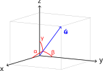

# Samples

## circuitikz-example.tex

```tikz
\documentclass{standalone}
\usepackage{circuitikz}
\begin{document}

\begin{circuitikz}[american voltages]
\draw
  (0,0) to [short, *-] (6,0)
  to [V, l_=$\mathrm{j}{\omega}_m \underline{\psi}^s_R$] (6,2) 
  to [R, l_=$R_R$] (6,4) 
  to [short, i_=$\underline{i}^s_R$] (5,4) 
  (0,0) to [open, v^>=$\underline{u}^s_s$] (0,4) 
  to [short, *- ,i=$\underline{i}^s_s$] (1,4) 
  to [R, l=$R_s$] (3,4)
  to [L, l=$L_{\sigma}$] (5,4) 
  to [short, i_=$\underline{i}^s_M$] (5,3) 
  to [L, l_=$L_M$] (5,0); 
\end{circuitikz}

\end{document}

```


## directional-angles.tex

```tikz
\documentclass{article}
\usepackage{tikz}
\usepackage{tikz-3dplot}
\usetikzlibrary{math}
\usepackage[active,tightpage]{preview}
\PreviewEnvironment{tikzpicture}
\setlength\PreviewBorder{0.125pt}
%
% File name: directional-angles.tex
% Description: 
% The directional angles of a vector are geometrically represented.
% 
% Date of creation: July, 25th, 2021.
% Date of last modification: October, 9th, 2022.
% Author: Efra�n Soto Apolinar.
% https://www.aprendematematicas.org.mx/author/efrain-soto-apolinar/instructing-courses/
% Source: page 11 of the 
% Glosario Ilustrado de Matematicas Escolares.
% https://tinyurl.com/5udm2ufy
%
% Terms of use:
% According to TikZ.net
% https://creativecommons.org/licenses/by-nc-sa/4.0/
% Your commitment to the terms of use is greatly appreciated.
%
\begin{document}
  \tdplotsetmaincoords{80}{120}
  %
  \begin{tikzpicture}[tdplot_main_coords,scale=0.75] 
    % Indicate the components of the vector in rectangular coordinates
    \pgfmathsetmacro{\ux}{4}
    \pgfmathsetmacro{\uy}{4}
    \pgfmathsetmacro{\uz}{3}
    % Length of each axis
    \pgfmathsetmacro{\ejex}{\ux+0.5}
    \pgfmathsetmacro{\ejey}{\uy+0.5}
    \pgfmathsetmacro{\ejez}{\uz+0.5}
    \pgfmathsetmacro{\umag}{sqrt(\ux*\ux+\uy*\uy+\uz*\uz)} % Magnitude of vector $\vec{u}$
    % Compute the angle $\theta$
    \pgfmathsetmacro{\angthetax}{pi*atan(\uy/\ux)/180}
    \pgfmathsetmacro{\angthetay}{pi*atan(\ux/\uz)/180}
    \pgfmathsetmacro{\angthetaz}{pi*atan(\uz/\uy)/180}
    % Compute the angle $\phi$
    \pgfmathsetmacro{\angphix}{pi*acos(\ux/\umag)/180}
    \pgfmathsetmacro{\angphiy}{pi*acos(\uy/\umag)/180}
    \pgfmathsetmacro{\angphiz}{pi*acos(\uz/\umag)/180}
    % Compute rho sin(phi) to simplify computations
    \pgfmathsetmacro{\costz}{cos(\angthetax r)}
    \pgfmathsetmacro{\sintz}{sin(\angthetax r)}
    \pgfmathsetmacro{\costy}{cos(\angthetay r)}
    \pgfmathsetmacro{\sinty}{sin(\angthetay r)}
    \pgfmathsetmacro{\costx}{cos(\angthetaz r)}
    \pgfmathsetmacro{\sintx}{sin(\angthetaz r)}
    % Coordinate axis
    \draw[thick,->] (0,0,0) -- (\ejex,0,0) node[below left] {$x$};
    \draw[thick,->] (0,0,0) -- (0,\ejey,0) node[right] {$y$};
    \draw[thick,->] (0,0,0) -- (0,0,\ejez) node[above] {$z$};
    % Projections of the components in the axis
    \draw[gray,very thin,opacity=0.5] (0,0,0) -- (\ux,0,0) -- (\ux,\uy,0) -- (0,\uy,0) -- (0,0,0);	% face on the plane z = 0
    \draw[gray,very thin,opacity=0.5] (0,0,\uz) -- (\ux,0,\uz) -- (\ux,\uy,\uz) -- (0,\uy,\uz) -- (0,0,\uz);	% face on the plane z = \uz
    \draw[gray,very thin,opacity=0.5] (0,0,0) -- (0,0,\uz) -- (\ux,0,\uz) -- (\ux,0,0) -- (0,0,0);	% face on the plane y = 0
    \draw[gray,very thin,opacity=0.5] (0,\uy,0) -- (0,\uy,\uz) -- (\ux,\uy,\uz) -- (\ux,\uy,0) -- (0,\uy,0);	% face on the plane y = \uy
    \draw[gray,very thin,opacity=0.5] (0,0,0) -- (0,\uy,0) -- (0,\uy,\uz) -- (0,0,\uz) -- (0,0,0); % face on the plane x = 0
    \draw[gray,very thin,opacity=0.5] (\ux,0,0) -- (\ux,\uy,0) -- (\ux,\uy,\uz) -- (\ux,0,\uz) -- (\ux,0,0); % face on the plane x = \ux
    % Arc indicating the angle $\alpha$
    % (angle formed by the vector $\vec{v}$ and the $x$ axis)
    \draw[red,thick] plot[domain=0:\angphix,smooth,variable=\t] ({cos(\t r)},{sin(\t r)*\costx},{sin(\t r)*\sintx});
    % Arc indicating the angle $\beta$
    % (angle formed by the vector $\vec{v}$ and the $y$ axis)
    \draw[red,thick] plot[domain=0:\angphiy,smooth,variable=\t] ({sin(\t r)*\sinty},{cos(\t r)},{sin(\t r)*\costy});
    % Arc indicating the angle $\gamma$
    % (angle formed by the vector $\vec{v}$ and the $z$ axis)
    \draw[red,thick] plot[domain=0:\angphiz,smooth,variable=\t] ({sin(\t r)*\costz},{sin(\t r)*\sintz},{cos(\t r)});
    % Vector $\vec{u}$
    \draw[blue,thick,->] (0,0,0) -- (\ux,\uy,\uz) node [below right] {$\vec{u}$};
    % Nodes indicating the direction angles
    \pgfmathsetmacro{\xa}{1.85*cos(0.5*\angphix r)}
    \pgfmathsetmacro{\ya}{1.85*sin(0.5*\angphix r)*\costx}
    \pgfmathsetmacro{\za}{1.85*sin(0.5*\angphiz r)*\sintx}
    \node[red] at (\xa,\ya,\za) {\footnotesize$\alpha$};
    %
    \pgfmathsetmacro{\xb}{1.5*sin(0.5*\angphiy r)*\sinty}
    \pgfmathsetmacro{\yb}{1.5*cos(0.5*\angphiy r)}
    \pgfmathsetmacro{\zb}{1.5*sin(0.5*\angphiy r)*\costy}
    \node[red] at (\xb,\yb,\zb) {\footnotesize$\beta$};
    %
    \pgfmathsetmacro{\xc}{1.5*sin(0.5*\angphiz r)*\costz}
    \pgfmathsetmacro{\yc}{1.5*sin(0.5*\angphiz r)*\sintz}
    \pgfmathsetmacro{\zc}{1.5*cos(0.5*\angphiz r)}
    \node[red] at (\xc,\yc,\zc) {\footnotesize$\gamma$};
    %
  \end{tikzpicture}
  %
\end{document}

```



## gates-example.tex

```tikz
\documentclass{standalone}
\usepackage{tikz}
\usetikzlibrary{circuits.logic.US}
\usetikzlibrary{positioning}

\begin{document}
\begin{tikzpicture}[circuit logic US, scale=2]
	 \node [and gate, inputs=nn] (lg1) {\scriptsize 1};
	 \node [and gate, inputs=nn, right=of lg1, xshift=-3mm, yshift=-4mm] (lg2) {\scriptsize 2};
	 \draw (lg1.output) -- ++(right:3mm) |- (lg2.input 1);
	 \draw (lg1.input 1) -- node[at end,left]{A} ++(left:3mm);
	 \draw (lg1.input 2) -- node[at end,left]{B} ++(left:3mm);
	 \draw (lg2.input 2) -- node[at end,left]{C} ++(left:19mm);
	 \draw (lg2.output) -- node[at end,right]{Y} ++(right:3mm);
 \end{tikzpicture}
\end{document}
```


